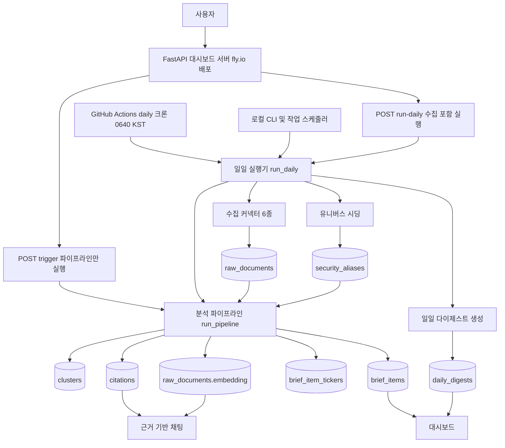

# 00. 시스템 전체 개요

## 한 줄 요약

이 프로젝트는 여러 뉴스/공시 소스를 매일 수집하고, 중복 제거와 근거 기반 AI 분석을 거쳐 대시보드와 채팅에서 볼 수 있는 "뉴스/공시 기반 영향 분석"을 만든다.

## 비개발자 설명

시스템은 매일 아침 여러 외부 소스에서 문서를 가져온다. 가져온 문서는 먼저 공통 형식으로 저장되고, 비슷한 문서끼리 묶인 뒤, 실제 문서에서 인용 가능한 근거가 있을 때만 영향 분석 결과로 바뀐다.

실행과 화면은 이제 둘 다 클라우드에서 돈다. 매일 06:40 KST에 GitHub Actions 워크플로가 일일 실행기를 돌려 매니지드 Postgres에 결과를 쌓고, 대시보드 서버는 fly.io에 배포돼 언제든 그 결과를 보여준다. 로컬 CLI(`python -m app.runner`)와 Windows 작업 스케줄러 스크립트도 남아 있어 수동 실행·재실행이 가능하다.

최종 화면은 크게 세 가지를 보여준다.

- 오늘 어떤 소스가 정상 수집됐는지
- 오늘의 핵심 흐름을 요약한 일일 다이제스트
- 개별 뉴스/공시가 어떤 종목이나 자산군에 영향을 줄 수 있는지와 그 근거

이 문서는 투자 추천을 설명하지 않는다. 코드는 "매수/매도 판단"이 아니라, 수집된 뉴스와 공시 근거 안에서 영향 가능성을 정리하는 구조로 되어 있다.

## 설계도

### 다이어그램 코드 매핑

| 설계도 박스 | 담당 코드 |
| --- | --- |
| `GitHub Actions daily 크론` | [`.github/workflows/daily.yml`](../../.github/workflows/daily.yml) — `uv run python -m app.runner` |
| `로컬 CLI 및 작업 스케줄러` | `app/runner.py::main`, [`scripts/schedule_daily.cmd`](../../scripts/schedule_daily.cmd) |
| `FastAPI 대시보드 서버` | [`app/main.py`](../../app/main.py), 배포: [`fly.toml`](../../fly.toml) + [`.github/workflows/deploy-dashboard.yml`](../../.github/workflows/deploy-dashboard.yml) |
| `POST trigger` | `app/main.py::trigger`, `app/pipeline/pipeline.py::run_pipeline` |
| `POST run-daily` | `app/main.py::run_daily_endpoint`, `app/runner.py::run_daily` |
| `일일 실행기 run_daily` | `app/runner.py::run_daily`, `app/runner.py::_collect` |
| `유니버스 시딩` | `app/pipeline/seed.py::seed_universe` |
| `수집 커넥터 6종` | `app/runner.py::build_default_connectors`, [`app/collector/base.py`](../../app/collector/base.py) |
| `분석 파이프라인 run_pipeline` | `app/pipeline/pipeline.py::run_pipeline` (dedup → cluster → generate_impact → analyze_impact → ticker_link → embed) |
| `raw_documents` 등 DB 저장소 | [`app/models.py`](../../app/models.py) |
| `일일 다이제스트 생성` | `app/pipeline/digest.py::build_digest` |
| `대시보드` | `app/main.py::dashboard`, [`app/web/queries.py`](../../app/web/queries.py), `app/web/templates/*.html` |
| `근거 기반 채팅` | `app/main.py::chat`, [`app/web/chat.py`](../../app/web/chat.py) |

## 코드/폴더 매핑

| 영역 | 역할 |
| --- | --- |
| [`app/main.py`](../../app/main.py) | FastAPI 앱, `/health`, `/trigger`, `/run-daily`, `/`, `/chat` 라우트. 보호 라우트는 Basic Auth(`_require_dashboard_auth`) |
| [`app/runner.py`](../../app/runner.py) | 매일 한 번 실행되는 전체 작업. 시딩, 수집, 분석, 임베딩, 다이제스트를 순서대로 호출 |
| [`app/config.py`](../../app/config.py) | pydantic-settings 설정. DB URL, API 키, 임베딩 모델, 신선도 윈도우 — 키 없으면 해당 기능 graceful 비활성 |
| [`app/collector/`](../../app/collector) | RSS, Naver, OpenDART, EDGAR, Marketaux, Finnhub 수집기 (`Connector` 계약: fetch → normalize → upsert) |
| [`app/pipeline/`](../../app/pipeline) | 중복 제거, 클러스터링, AI 분석, 종목 연결, 임베딩, 다이제스트, 유니버스 시딩 |
| [`app/web/`](../../app/web) | 화면 조회용 쿼리, 채팅 분석, HTML 템플릿, CSS |
| [`app/models.py`](../../app/models.py) | SQLAlchemy ORM 모델. `sources`, `raw_documents`, `clusters`, `cluster_members`, `brief_items`, `brief_item_tickers`, `citations`, `coverage`, `security_aliases`, `audit_log`, `daily_digests`, `digest_sources` |
| [`migrations/versions/`](../../migrations/versions) | 실제 DB 스키마 변경 이력 |
| [`.github/workflows/`](../../.github/workflows) | `ci.yml`(테스트/린트), `daily.yml`(일일 실행), `deploy-dashboard.yml`(CI 성공 시 fly.io 배포) |
| [`fly.toml`](../../fly.toml) / [`Dockerfile`](../../Dockerfile) | 대시보드 fly.io 배포 설정(nrt 리전, 4GB — bge-m3 로드 여유, 유휴 시 자동 정지) |
| [`tests/`](../../tests) | 수집기, 파이프라인, 다이제스트, RAG 채팅, 화면 검증 테스트 |

## 왜 이렇게 만들었나

하나의 큰 AI 호출로 모든 것을 처리하지 않고, 수집, 정규화, 중복 제거, 분석, 종목 연결, 화면 조회를 나눈다. 이렇게 하면 어느 단계에서 문제가 생겼는지 알기 쉽고, 외부 API 하나가 실패해도 전체 시스템이 멈추지 않게 만들 수 있다. 소스 격리는 실측으로 강제된 원칙이다 — publisher RSS가 기본 UA에 403을 주거나 OpenDART가 원본 없는 공시에 ZIP 대신 상태 XML을 200으로 주는 일이 실제로 있었고, `_collect`는 커넥터마다 try/except로 격리해 실패를 `audit_log`에만 남기고 다음 소스로 넘어간다.

DB가 중심 저장소다. 수집 원문, 분석 결과, 인용 근거, 다이제스트, 실행 로그가 모두 테이블로 남기 때문에 화면과 채팅은 같은 근거를 다시 조회해 보여줄 수 있다. 실행기와 대시보드가 서로 다른 곳(GitHub Actions 러너, fly.io 머신, 로컬)에서 돌아도 같은 매니지드 Postgres를 보면 되는 것도 이 구조 덕분이다. Actions의 service 컨테이너는 job이 끝나면 삭제되므로 일일 누적(dedup·랭킹)에 쓸 수 없고, 반드시 외부 매니지드 DB를 `DATABASE_URL` 시크릿으로 주입한다.

동시 실행 방지는 Postgres advisory lock으로 한다. `run_daily`와 `run_pipeline`이 서로 다른 락 키를 쓰고(같으면 run_daily 안에서 부르는 run_pipeline이 자기 자신에게 막힌다), 락은 반드시 전용 연결(`with engine.connect() as lock_conn:`)에 고정한다 — 작업 세션에서 잡고 커밋 뒤 풀면 커밋이 연결을 풀에 반납해 언락이 다른 연결에서 돌아 락이 누수됐던 실측 사고가 있다. GitHub Actions의 `concurrency` 그룹은 이 앱 내부 락과 별개의 1차 방어다.

날짜 경계는 전부 KST로 앵커한다. `brief_date`는 `datetime.now(_KST).date()`로 산출되며, 신선도 컷오프를 UTC 자정으로 잡으면 KST 오전 실행분(전날 저녁~당일 새벽 UTC 발행)이 통째로 잘려 클러스터·브리프가 0이 되는 사고가 실측됐다(`_freshness_cutoff`가 KST 종일 기준). 06:40 KST 크론이 UTC로는 전날 21:40인 것도 같은 이유로 워크플로 주석에 박아 뒀다.

로컬 개발 환경(사내 TLS 가로채기)에서는 외부 HTTPS 요청에 truststore로 OS 인증서 저장소를 신뢰시켜야 하고, API 키를 쿼리스트링에 싣는 소스(OpenDART) 때문에 러너가 httpx 로깅을 WARNING으로 억제한다 — 운영상 잔사고를 코드 경계 안에서 흡수하는 방식이다.

## 관련 테스트

| 테스트 파일 | 막는 사고 |
| --- | --- |
| [`tests/test_runner.py`](../../tests/test_runner.py) | 일일 실행이 수집기 실패를 격리하고 중복 실행을 막는지 검증 |
| [`tests/test_pipeline.py`](../../tests/test_pipeline.py) | 문서가 클러스터와 브리프 결과로 안정적으로 바뀌는지 검증 |
| [`tests/test_digest.py`](../../tests/test_digest.py) | 근거 없는 다이제스트를 만들지 않는지 검증 |
| [`tests/test_web.py`](../../tests/test_web.py) | 대시보드와 날짜/채팅 화면이 필요한 데이터를 보여주는지 검증 |
| [`tests/test_rag_chat.py`](../../tests/test_rag_chat.py) | 누적 근거 검색 기반 채팅이 근거 없이 답하지 않는지 검증 |
| [`tests/test_freshness.py`](../../tests/test_freshness.py) | 신선도 컷오프가 KST 기준일에 맞게 동작하는지 검증 |

## 다음에 읽을 문서

- [01. 데이터 수집 구조](01-data-collection.md)
