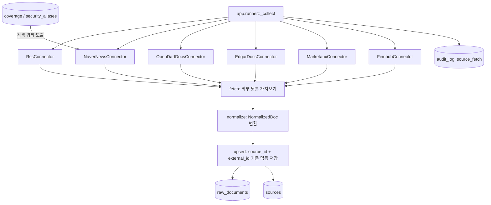

# 01. 데이터 수집 구조

## 한 줄 요약

수집기는 외부 소스별로 분리되어 있고, 모두 `fetch -> normalize -> upsert` 계약을 따라 `raw_documents` 테이블에 공통 형식으로 저장한다.

## 비개발자 설명

외부 데이터는 출처마다 모양이 다르다. RSS는 XML이고, Naver/Marketaux/Finnhub는 뉴스 API 응답이며, OpenDART와 EDGAR는 공시 문서 목록과 본문을 다룬다. 이 프로젝트는 각 출처의 복잡한 차이를 수집기 안에 가두고, 나머지 파이프라인은 모두 같은 모양의 문서만 보게 만든다.

공통 문서 모양은 `NormalizedDoc`이다. 제목, 요약, 본문, URL, 발행 시각, 언어, 원본 payload가 들어가며, DB에는 `Source`와 `RawDocument`로 저장된다.

한 가지 중요한 경계가 있다. 뉴스는 저작권 때문에 헤드라인+요약+링크까지만 저장하고(`body=None`), 공개 법정공시(OpenDART·EDGAR)만 본문 전체를 저장한다. 그래서 이후 분석 단계에서 "본문 근거"를 댈 수 있는 문서는 공시뿐이다.

## 설계도

### 다이어그램 코드 매핑

| 설계도 박스 | 담당 코드 |
| --- | --- |
| `app.runner::_collect` | [`app/runner.py`](../../app/runner.py)의 `_collect` |
| `RssConnector` | [`app/collector/rss.py`](../../app/collector/rss.py) |
| `NaverNewsConnector` | [`app/collector/naver.py`](../../app/collector/naver.py) |
| coverage 기반 쿼리 도출 | `app/collector/naver.py::load_coverage_queries` |
| `OpenDartDocsConnector` | [`app/collector/opendart_docs.py`](../../app/collector/opendart_docs.py) |
| `EdgarDocsConnector` | [`app/collector/edgar_docs.py`](../../app/collector/edgar_docs.py) |
| `MarketauxConnector` | [`app/collector/marketaux.py`](../../app/collector/marketaux.py) |
| `FinnhubConnector` | [`app/collector/finnhub.py`](../../app/collector/finnhub.py) |
| `NormalizedDoc`, `Connector` | [`app/collector/base.py`](../../app/collector/base.py) |
| `raw_documents`, `sources`, `audit_log` | [`app/models.py`](../../app/models.py) |

## 코드/폴더 매핑

| 코드 | 하는 일 |
| --- | --- |
| `app/collector/base.py::Connector` | 모든 수집기가 반드시 구현해야 하는 인터페이스(`fetch`/`normalize`/`upsert`) |
| `app/collector/base.py::NormalizedDoc` | 파이프라인이 이해하는 공통 문서 포맷 |
| `app/runner.py::build_default_connectors` | 기본 일일 실행에 포함되는 수집기 6종 구성. 네이버 쿼리는 DB(coverage)에서 도출하고, EDGAR CIK 유니버스도 코드에 하드코딩하지 않는다(`ciks=[]`) |
| `app/runner.py::_collect` | 수집기별 `fetch`, `normalize`, `upsert`를 실행하고 소스당 `audit_log` 1행(action=`source_fetch`)을 기록 |
| `app/models.py::Source` | 데이터 출처 이름, 종류(`news`/`filing`), 법적 근거(`legal_basis`) 저장 |
| `app/models.py::RawDocument` | 수집된 문서 원본, 요약, 링크, 임베딩 저장 |

## 수집기별 역할

| 수집기 | 주 데이터 | 특징 |
| --- | --- | --- |
| RSS | 크립토·KR 경제지·연준/ECB 피드 | XML 파싱, feed별 `lang`. 피드별 try/except 격리로 한 피드 403이 나머지를 막지 않음. 브라우저 User-Agent 사용 |
| Naver | 한국어 뉴스 검색 | 검색 쿼리를 `coverage`/`security_aliases`에서 도출(`load_coverage_queries`). HTML 태그 제거, Client-Id/Secret 헤더 인증 |
| OpenDART 문서 | 한국 공시 본문 | `list.json`으로 목록 조회 후 `document.xml` ZIP에서 본문 추출. ZIP 매직(`PK`) 검사, status 014(파일 없음)는 그 공시만 스킵, throttle+백오프 |
| EDGAR 문서 | 미국 공시 본문 | per-company submissions JSON(병렬 배열)에서 8-K/10-Q를 걸러 HTML 본문을 텍스트로 변환. 식별용 User-Agent 필수, throttle+429 백오프 |
| Marketaux | 크립토 뉴스(엔티티 태깅) | API 토큰 필수, 심볼 필터(BTC·ETH 등), 무료 티어 100 req/day |
| Finnhub | 크립토 뉴스 | API 토큰 필수, `category=crypto`, Unix epoch 발행 시각 파싱 |

공통 규칙: 뉴스 계열(RSS·Naver·Marketaux·Finnhub)은 `body=None`(헤드라인+요약+링크만), 공시 계열(OpenDART·EDGAR)만 `body`를 채운다. 모든 수집기에서 `parse_*`/`normalize`는 순수 함수(네트워크·DB 없이 테스트 가능)이고 `fetch`/`upsert`만 I/O를 한다. `upsert`는 `uq_raw_documents_source_external` 제약에 `on_conflict_do_nothing`으로 멱등이다.

## 왜 이렇게 만들었나

외부 소스는 자주 실패한다. API 키가 없거나, 쿼터가 소진되거나, 특정 응답이 깨질 수 있다. 그래서 `_collect`는 각 수집기를 별도 `try/except`로 감싸고, 실패한 소스는 `SourceResult(status="error")`로 기록한 뒤 다음 수집기로 넘어간다. 목적은 "모든 소스가 성공해야만 하루 작업이 성공"이 아니라 "가능한 소스는 계속 처리하고, 실패한 소스는 운영자가 알 수 있게 기록"하는 것이다. 같은 격리가 소스 내부에도 있다: RSS는 피드 단위로, OpenDART는 공시 문서 단위로 실패를 가둔다.

실측으로 굳어진 결정들:

- **truststore로 OS 인증서 신뢰**: 사내 TLS 가로채기 환경에서 기본 httpx 인증서 검증이 `CERTIFICATE_VERIFY_FAILED`로 죽는다. 모든 수집기가 `truststore.SSLContext(ssl.PROTOCOL_TLS_CLIENT)`를 `httpx.Client(verify=ctx)`에 좁게 주입한다.
- **ZIP 매직 검사 (OpenDART)**: `document.xml`은 원본파일 없는 공시에 ZIP 대신 에러 XML을 HTTP 200으로 준다(실측: 100건 중 34건). 무조건 unzip하면 `BadZipFile`로 소스 전체가 error가 되므로, `resp.content[:2] != b"PK"`면 에러 XML을 파싱해 014만 스킵하고 전역 에러(키·한도)는 소스를 멈춘다.
- **브라우저 UA + 죽은 피드 제거 (RSS)**: 일부 퍼블리셔(mk.co.kr)는 기본 httpx UA에 403을 주고, 로이터 퍼블릭 RSS는 폐지됐다. 브라우저 User-Agent를 보내고 죽은 피드는 `DEFAULT_FEEDS`에서 뺐으며, 피드별 격리로 한 피드 실패가 뒤 순번 피드를 건너뛰게 하던 회귀를 막았다.
- **쿼리스트링 API 키 로깅 억제**: OpenDART `crtfc_key`처럼 키가 URL에 실리는 API는 httpx INFO 로깅이 키를 노출한다. 러너가 `logging.getLogger("httpx").setLevel(logging.WARNING)`으로 억제한다(커넥터는 전역 로깅을 건드리지 않는다).
- **KST 앵커링**: OpenDART `rcept_dt`(YYYYMMDD)는 KST 자정으로 해석해 UTC aware로 변환한다. 날짜 경계를 UTC로 잘못 잡으면 신선도 컷오프에서 KST 오전 수집분이 통째로 잘리는 실측 사고가 있었다.
- **유니버스는 DB에서**: 네이버 검색 쿼리와 EDGAR CIK 목록을 코드에 하드코딩하지 않는다. 빈 coverage → 빈 쿼리 → no-op이 정상 동작이다.

도메인 주의: 여기서 모은 뉴스·공시는 이후 단계에서 "영향도 분석"의 근거로만 쓰인다. `Source.legal_basis`와 뉴스/공시 본문 경계(P5)를 수집 단계에서 강제하는 이유다.

## 관련 테스트

| 테스트 파일 | 막는 사고 |
| --- | --- |
| [`tests/test_rss.py`](../../tests/test_rss.py) | RSS 파싱·언어 처리 오류, 한 피드 실패가 나머지 피드를 죽이는 회귀, 소스 간 신디케이션 중복 |
| [`tests/test_naver.py`](../../tests/test_naver.py) | Naver 응답 파싱, 인증 헤더 누락, coverage 기반 쿼리 도출 오류 |
| [`tests/test_opendart_docs.py`](../../tests/test_opendart_docs.py) | OpenDART 목록/본문 추출 오류, 014 스킵 vs 전역 에러 구분 실패, 키 미설정 |
| [`tests/test_edgar_docs.py`](../../tests/test_edgar_docs.py) | EDGAR 병렬 배열 파싱·폼 필터링 오류, User-Agent 누락 |
| [`tests/test_marketaux.py`](../../tests/test_marketaux.py) | Marketaux API 토큰 누락과 날짜 파싱 오류 |
| [`tests/test_finnhub.py`](../../tests/test_finnhub.py) | Finnhub API 토큰 누락과 Unix timestamp 파싱 오류 |
| [`tests/test_runner.py`](../../tests/test_runner.py) | 한 수집기 실패가 전체 일일 실행을 멈추는 사고 |

## 다음에 읽을 문서

1. [일일 실행과 트리거](02-daily-run-and-trigger.md)
