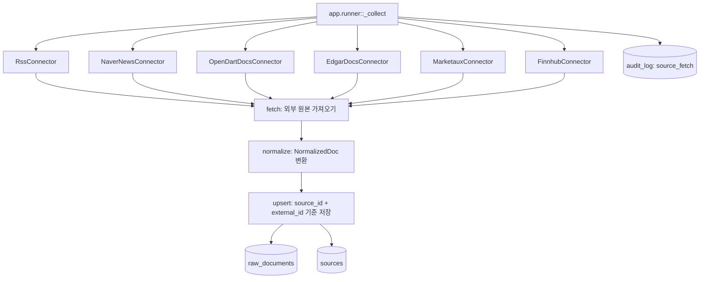

# 01. 데이터 수집 구조

## 한 줄 요약

수집기는 외부 소스별로 분리되어 있고, 모두 `fetch -> normalize -> upsert` 계약을 따라 `raw_documents` 테이블에 공통 형식으로 저장한다.

## 비개발자 설명

외부 데이터는 출처마다 모양이 다르다. RSS는 XML이고, Naver/Marketaux/Finnhub는 뉴스 API 응답이며, OpenDART와 EDGAR는 공시 문서 목록과 본문을 다룬다. 이 프로젝트는 각 출처의 복잡한 차이를 수집기 안에 가두고, 나머지 파이프라인은 모두 같은 모양의 문서만 보게 만든다.

공통 문서 모양은 `NormalizedDoc`이다. 제목, 요약, 본문, URL, 발행 시각, 언어, 원본 payload가 들어가며, DB에는 `Source`와 `RawDocument`로 저장된다.

## 설계도

### 다이어그램 코드 매핑

| 설계도 박스 | 담당 코드 |
| --- | --- |
| `app.runner::_collect` | [`app/runner.py`](../../app/runner.py)의 `_collect` |
| `RssConnector` | [`app/collector/rss.py`](../../app/collector/rss.py) |
| `NaverNewsConnector` | [`app/collector/naver.py`](../../app/collector/naver.py) |
| `OpenDartDocsConnector` | [`app/collector/opendart_docs.py`](../../app/collector/opendart_docs.py) |
| `EdgarDocsConnector` | [`app/collector/edgar_docs.py`](../../app/collector/edgar_docs.py) |
| `MarketauxConnector` | [`app/collector/marketaux.py`](../../app/collector/marketaux.py) |
| `FinnhubConnector` | [`app/collector/finnhub.py`](../../app/collector/finnhub.py) |
| `NormalizedDoc`, `Connector` | [`app/collector/base.py`](../../app/collector/base.py) |
| `raw_documents`, `sources`, `audit_log` | [`app/models.py`](../../app/models.py) |

## 코드/폴더 매핑

| 코드 | 하는 일 |
| --- | --- |
| `app.collector.base::Connector` | 모든 수집기가 반드시 구현해야 하는 인터페이스 |
| `app.collector.base::NormalizedDoc` | 파이프라인이 이해하는 공통 문서 포맷 |
| `app.runner::build_default_connectors` | 기본 일일 실행에 포함되는 수집기 목록 구성 |
| `app.runner::_collect` | 수집기별 `fetch`, `normalize`, `upsert`를 실행하고 결과를 `audit_log`에 기록 |
| `app.models::Source` | 데이터 출처 이름과 종류 저장 |
| `app.models::RawDocument` | 수집된 문서 원본, 요약, 링크, 임베딩 저장 |

## 수집기별 역할

| 수집기 | 주 데이터 | 특징 |
| --- | --- | --- |
| RSS | 뉴스 피드 | XML을 파싱하고 feed 언어 설정에 따라 `lang`을 채움 |
| Naver | 한국어 뉴스 검색 | HTML 태그를 제거하고 Naver API 인증 헤더를 사용 |
| OpenDART 문서 | 한국 공시 | 공시 목록 조회 후 문서 ZIP에서 본문을 추출 |
| EDGAR 문서 | 미국 공시 | CIK 목록을 기준으로 SEC 제출 문서와 본문을 가져옴 |
| Marketaux | 글로벌 시장 뉴스 | API 토큰 기반 뉴스 수집 |
| Finnhub | 시장/가상자산 뉴스 | API 토큰 기반 뉴스 수집 |

## 왜 이렇게 만들었나

외부 소스는 자주 실패한다. API 키가 없거나, 쿼터가 소진되거나, 특정 응답이 깨질 수 있다. 그래서 `_collect`는 각 수집기를 별도 `try/except`로 감싸고, 실패한 소스는 `SourceResult(status="error")`로 기록한 뒤 다음 수집기로 넘어간다.

이 구조의 목적은 "모든 소스가 성공해야만 하루 작업이 성공"이 아니라 "가능한 소스는 계속 처리하고, 실패한 소스는 운영자가 알 수 있게 기록"하는 것이다.

## 관련 테스트

| 테스트 파일 | 막는 사고 |
| --- | --- |
| [`tests/test_rss.py`](../../tests/test_rss.py) | RSS 파싱, 언어 처리, 중복 후보 처리 오류 |
| [`tests/test_naver.py`](../../tests/test_naver.py) | Naver 뉴스 응답 파싱과 인증 헤더 누락 |
| [`tests/test_opendart_docs.py`](../../tests/test_opendart_docs.py) | OpenDART 목록/본문 추출과 API 오류 처리 |
| [`tests/test_edgar_docs.py`](../../tests/test_edgar_docs.py) | EDGAR 제출 문서 필터링과 User-Agent 누락 |
| [`tests/test_marketaux.py`](../../tests/test_marketaux.py) | Marketaux API 토큰과 날짜 파싱 오류 |
| [`tests/test_finnhub.py`](../../tests/test_finnhub.py) | Finnhub API 토큰과 Unix timestamp 파싱 오류 |
| [`tests/test_runner.py`](../../tests/test_runner.py) | 한 수집기 실패가 전체 일일 실행을 멈추는 사고 |

## 다음에 읽을 문서

1. [02. 일일 실행과 트리거](./02-daily-run-and-trigger.md)
2. [03. 영향 분석 파이프라인](./03-impact-pipeline.md)
