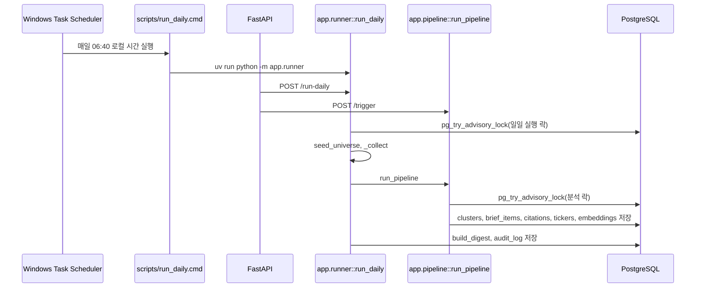

# 02. 일일 실행과 트리거

## 한 줄 요약

`/run-daily`와 `python -m app.runner`는 수집까지 포함한 전체 실행이고, `/trigger`는 이미 수집된 문서를 대상으로 분석 파이프라인만 빠르게 다시 돌리는 경로다.

## 비개발자 설명

시스템을 실행하는 방법은 세 가지가 있다.

- 정기 실행: Windows 작업 스케줄러가 매일 `scripts/run_daily.cmd`를 실행한다.
- 수동 전체 실행: 운영자가 `/run-daily`를 호출하면 수집부터 다이제스트까지 한 번 실행된다.
- 빠른 재분석: 운영자가 `/trigger`를 호출하면 새 수집 없이 기존 DB 문서를 분석한다.

정기 실행과 수동 전체 실행은 같은 중심 함수인 `run_daily`를 사용한다. 빠른 재분석은 `run_pipeline`만 호출한다.

## 설계도

### 다이어그램 코드 매핑

| 설계도 박스 | 담당 코드 |
| --- | --- |
| `Windows Task Scheduler` | [`scripts/schedule_daily.cmd`](../../scripts/schedule_daily.cmd) |
| `scripts/run_daily.cmd` | [`scripts/run_daily.cmd`](../../scripts/run_daily.cmd) |
| `POST /run-daily` | `app/main.py::run_daily_endpoint` |
| `POST /trigger` | `app/main.py::trigger` |
| `app.runner::run_daily` | [`app/runner.py`](../../app/runner.py)의 `run_daily` |
| `app.pipeline::run_pipeline` | [`app/pipeline/pipeline.py`](../../app/pipeline/pipeline.py)의 `run_pipeline` |
| `pg_try_advisory_lock` | `app/runner.py::_DAILY_LOCK_KEY`, `app/pipeline/pipeline.py::_PIPELINE_LOCK_KEY` |

## 코드/폴더 매핑

| 경로 | 역할 |
| --- | --- |
| [`app/main.py`](../../app/main.py) | HTTP 엔드포인트 정의. `/trigger`, `/run-daily`, `/` 화면, `/chat` |
| [`app/runner.py`](../../app/runner.py) | CLI와 일일 실행 본체. `run_daily`, `main`, `_collect`, `_digest_status` |
| [`app/pipeline/pipeline.py`](../../app/pipeline/pipeline.py) | 수집 이후 분석 파이프라인. `run_pipeline` |
| [`scripts/run_daily.cmd`](../../scripts/run_daily.cmd) | 프로젝트 루트로 이동 후 `uv run python -m app.runner` 실행, 로그 저장 |
| [`scripts/schedule_daily.cmd`](../../scripts/schedule_daily.cmd) | Windows 작업 스케줄러에 매일 06:40 작업 등록 |

## 실행 경로 비교

| 실행 경로 | 수집 | 분석 | 임베딩 | 다이제스트 | 주 용도 |
| --- | --- | --- | --- | --- | --- |
| `POST /run-daily` | 포함 | 포함 | `get_embedder()`가 가능하면 포함 | 포함 | 운영자가 전체 작업을 수동 실행 |
| `python -m app.runner` | 포함 | 포함 | `get_embedder()`가 가능하면 포함 | 포함 | 스케줄러나 콘솔에서 실행 |
| `POST /trigger` | 없음 | 포함 | 기본 호출에서는 없음 | 없음 | 이미 수집된 문서로 빠르게 재분석 |

## 왜 이렇게 만들었나

수집은 외부 API와 네트워크에 영향을 많이 받는다. 반면 분석은 이미 저장된 `raw_documents`를 대상으로 실행할 수 있다. 그래서 "전체 실행"과 "분석만 다시 실행"을 분리하면 운영자가 상황에 따라 빠른 경로를 선택할 수 있다.

또한 같은 작업이 동시에 두 번 실행되면 중복 클러스터나 중복 브리프가 생길 수 있다. 이를 막기 위해 DB advisory lock을 사용한다. 일일 실행과 분석 파이프라인은 서로 다른 lock key를 사용해서, 각각의 동시 실행을 명확히 거절한다.

## 관련 테스트

| 테스트 파일 | 막는 사고 |
| --- | --- |
| [`tests/test_runner.py`](../../tests/test_runner.py) | 일일 실행 중복 실행, 수집기 실패, 다이제스트 호출 누락 |
| [`tests/test_health.py`](../../tests/test_health.py) | `/trigger`가 오늘 KST 날짜로 파이프라인을 호출하고 충돌 시 409를 반환하는지 |
| [`tests/test_integration_stage15.py`](../../tests/test_integration_stage15.py) | 일일 실행 결과가 검색 가능한 코퍼스로 이어지는지 |

## 다음에 읽을 문서

1. [03. 영향 분석 파이프라인](./03-impact-pipeline.md)
2. [05. 다이제스트와 RAG](./05-digest-and-rag.md)
