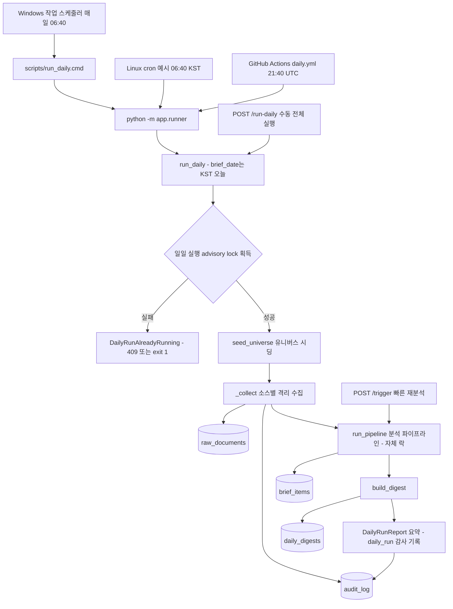

# 02. 일일 실행과 트리거

## 한 줄 요약

`run_daily`(로컬 스케줄러·GitHub Actions·`/run-daily`가 모두 같은 함수를 부른다)는 수집부터 다이제스트까지의 전체 실행이고, `/trigger`는 이미 수집된 문서를 대상으로 분석 파이프라인만 빠르게 다시 돌리는 경로다.

## 비개발자 설명

시스템을 실행하는 방법은 크게 세 갈래다.

- 정기 실행(로컬): Windows 작업 스케줄러가 매일 06:40에 `scripts/run_daily.cmd`를 실행한다. Linux 서버라면 `scripts/crontab.example`의 크론 한 줄이 같은 역할을 한다.
- 정기 실행(클라우드): GitHub Actions가 매일 21:40 UTC(=06:40 KST)에 `daily.yml` 워크플로로 같은 러너를 돌린다. 내 PC가 꺼져 있어도 실행된다.
- 수동 실행: 운영자가 대시보드 인증을 거쳐 `/run-daily`를 호출하면 수집부터 다이제스트까지 한 번 실행되고, `/trigger`를 호출하면 새 수집 없이 기존 DB 문서만 다시 분석한다.

어느 경로로 들어와도 "기준일"(brief_date)은 한국 시간(KST) 기준 오늘이다. 그리고 같은 작업이 동시에 두 번 돌지 않도록 DB에 잠금을 걸어, 이미 실행 중이면 두 번째 요청은 정중히 거절된다.

## 설계도

### 다이어그램 코드 매핑

| 설계도 박스 | 담당 코드 |
| --- | --- |
| Windows 작업 스케줄러 | [`scripts/schedule_daily.cmd`](../../scripts/schedule_daily.cmd) (schtasks 등록) |
| scripts/run_daily.cmd | [`scripts/run_daily.cmd`](../../scripts/run_daily.cmd) |
| Linux cron 예시 | [`scripts/crontab.example`](../../scripts/crontab.example) |
| GitHub Actions daily.yml | [`.github/workflows/daily.yml`](../../.github/workflows/daily.yml) |
| python -m app.runner | `app/runner.py::main` |
| POST /run-daily | `app/main.py::run_daily_endpoint` |
| POST /trigger | `app/main.py::trigger` |
| run_daily | `app/runner.py::run_daily` |
| 일일 실행 advisory lock | `app/runner.py::_DAILY_LOCK_KEY`, `app/pipeline/pipeline.py::_PIPELINE_LOCK_KEY` |
| seed_universe 유니버스 시딩 | `app/pipeline/seed.py::seed_universe` |
| _collect 소스별 격리 수집 | `app/runner.py::_collect` |
| run_pipeline 분석 파이프라인 | `app/pipeline/pipeline.py::run_pipeline` |
| build_digest | `app/pipeline/digest.py::build_digest` |
| DailyRunReport 요약 | `app/runner.py::DailyRunReport`, `app/runner.py::_digest_status` |

## 코드/폴더 매핑

| 경로 | 역할 |
| --- | --- |
| [`app/main.py`](../../app/main.py) | HTTP 엔드포인트. `/trigger`, `/run-daily`(둘 다 대시보드 Basic 인증 필요), `/` 대시보드, `/chat` |
| [`app/runner.py`](../../app/runner.py) | 일일 실행 본체와 CLI. `run_daily`, `main`, `build_default_connectors`, `_collect`, `_count_embedded`, `_digest_status` |
| [`app/pipeline/pipeline.py`](../../app/pipeline/pipeline.py) | 수집 이후 분석 파이프라인. `run_pipeline`, `_freshness_cutoff` |
| [`scripts/run_daily.cmd`](../../scripts/run_daily.cmd) | 스크립트 위치에서 프로젝트 루트를 유도해 `uv run python -m app.runner` 실행, `logs\daily.log`에 로그 누적 |
| [`scripts/schedule_daily.cmd`](../../scripts/schedule_daily.cmd) | Windows 작업 스케줄러에 매일 06:40(OS 로컬 시간) 작업 등록 |
| [`scripts/crontab.example`](../../scripts/crontab.example) | Linux/VM 크론 예시. 서버가 UTC면 전날 21:40 UTC 라인을 쓴다 |
| [`.github/workflows/daily.yml`](../../.github/workflows/daily.yml) | 클라우드 일일 실행. cron `40 21 * * *`(UTC) + `workflow_dispatch`, `alembic upgrade head` 후 러너 실행 |

## 실행 경로 비교

| 실행 경로 | 진입점 | 시각 | 수집 | 분석 | 임베딩 | 다이제스트 |
| --- | --- | --- | --- | --- | --- | --- |
| 로컬 스케줄러 (schtasks/cron) | `scripts/run_daily.cmd` → `python -m app.runner` | 매일 06:40 로컬(=KST 가정) | 포함 | 포함 | embeddings extra 설치 시 포함 | 포함 |
| GitHub Actions (`daily.yml`) | `uv run python -m app.runner` | 매일 21:40 UTC = 06:40 KST | 포함 | 포함 | extra 미설치 → `get_embedder()`가 None으로 graceful 스킵 | 포함 |
| 수동 전체 실행 `POST /run-daily` | `app/main.py::run_daily_endpoint` | 임의 | 포함 | 포함 | 가능하면 포함 | 포함 |
| 빠른 재분석 `POST /trigger` | `app/main.py::trigger` | 임의 | 없음 | 포함 | 기본 호출에서는 없음 | 없음 |

클라우드 경로의 특이점: Actions의 service 컨테이너 DB는 job 종료 시 삭제되므로 일일 누적(dedup·랭킹)에 쓸 수 없다. 그래서 매니지드 Postgres+pgvector를 `DATABASE_URL` 시크릿으로 주입하고, 러너 전에 `alembic upgrade head`를 돌린다. `schedule`은 best-effort(고부하 시 지연·드물게 스킵)이고 main 브랜치에 파일이 있어야 활성화되며, `concurrency: group: daily`가 앱 내부 advisory lock과 별개의 1차 겹침 방지다.

운영 주의: `run_daily` 재실행은 멱등 no-op이 아니다. 신선도 윈도우 안의 새 뉴스를 또 수집하는 "새 배치"이므로, 크래시 복구는 재실행 대신 `build_digest`와 감사 로그로 필요한 단계만 다시 돌리는 편이 안전하다.

## 왜 이렇게 만들었나

- 전체 실행과 재분석의 분리: 수집은 외부 API·네트워크에 좌우되지만 분석은 이미 저장된 `raw_documents`만 있으면 된다. `/trigger`를 `run_pipeline`만 도는 빠른 경로로 남겨, 운영자가 상황에 맞는 경로를 고를 수 있다.
- brief_date는 KST 기준일: 06:40 KST 크론과 같은 기준일로 맞추기 위해 `datetime.now(_KST).date()`를 쓴다. 신선도 컷오프를 UTC 자정으로 앵커했을 때 KST 오전 실행에서 전날 저녁~당일 새벽(UTC) 발행 뉴스가 통째로 잘려 132건을 수집하고도 후보 0건·빈 다이제스트가 나온 실측 회귀가 있어, 종일 경계도 `_freshness_cutoff`에서 KST로 앵커한다.
- advisory lock은 전용 연결에 고정: 작업 세션에서 락을 잡고 `session.commit()` 뒤 `finally`에서 풀면, 커밋이 그 연결을 풀에 반납해 언락이 다른 풀 연결에서 돌아 락이 누수된다(후속 실행이 전부 `DailyRunAlreadyRunning`으로 거절되는 사고). 그래서 `with engine.connect() as lock_conn:`으로 같은 연결에서 잡고/푼다.
- 락 키 두 개: `run_daily`가 안에서 `run_pipeline`을 부르는데 둘이 같은 키를 쓰면 자기 락에 자기가 막힌다. 그래서 `_DAILY_LOCK_KEY`(1_958_374_621)와 `_PIPELINE_LOCK_KEY`(1_958_374_620)를 분리해 일일 실행과 파이프라인 각각의 동시 실행만 정확히 거절한다.
- 소스 격리: 한 소스의 장애(타임아웃·쿼터·키 부재)가 나머지 수집을 멈추면 안 된다. `_collect`는 커넥터마다 try/except로 격리하고 소스별 `source_fetch` 감사 행을 남긴다.
- httpx 로깅 억제: OpenDART는 API 키(`crtfc_key`)를 쿼리스트링으로 받아 httpx INFO 로그가 URL째로 키를 노출한다. 수집을 트리거하는 러너에서 httpx 로거를 WARNING으로 내린다.
- cp949 stdout 방어: Windows CLI에서 비-ASCII(한글·em dash) `print`는 cp949 stdout에서 `UnicodeEncodeError`로 죽는다(데이터는 다 커밋됐는데 exit 1이 난 실측). `main()` 진입부에서 `sys.stdout.reconfigure(encoding="utf-8")`을 부른다.

## 관련 테스트

| 테스트 파일 | 무엇을 검증하나 |
| --- | --- |
| [`tests/test_runner.py`](../../tests/test_runner.py) | 소스 실패 격리, 빈 수집일 무크래시, `_DAILY_LOCK_KEY` 동시 실행 거절, seeder 1회 호출·감사 기록, 수집→brief_items·다이제스트 연결 |
| [`tests/test_freshness.py`](../../tests/test_freshness.py) | `_freshness_cutoff`가 KST 종일 경계로 앵커되는지 — KST 오전 뉴스가 잘리던 회귀 방지 |
| [`tests/test_health.py`](../../tests/test_health.py) | `/trigger`·`/run-daily` 미인증 401, `/trigger`가 오늘 KST 날짜로 파이프라인 호출·충돌 시 409 |
| [`tests/test_integration_stage15.py`](../../tests/test_integration_stage15.py) | `run_daily` 결과(수집→파이프라인→임베딩→다이제스트)가 검색 가능한 코퍼스로 이어지는지 |

## 다음에 읽을 문서

[영향 분석 파이프라인](03-impact-pipeline.md)
