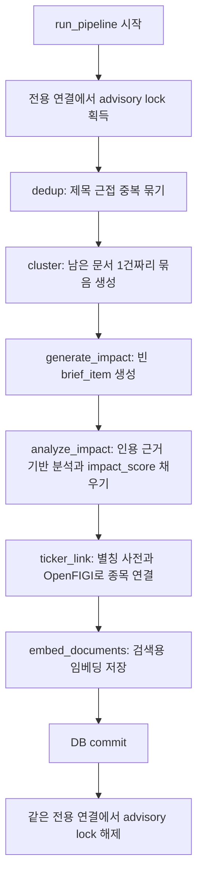
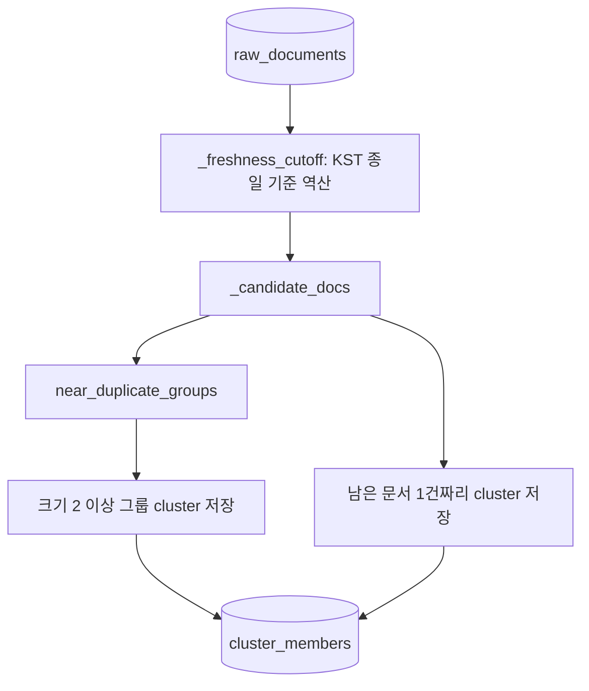
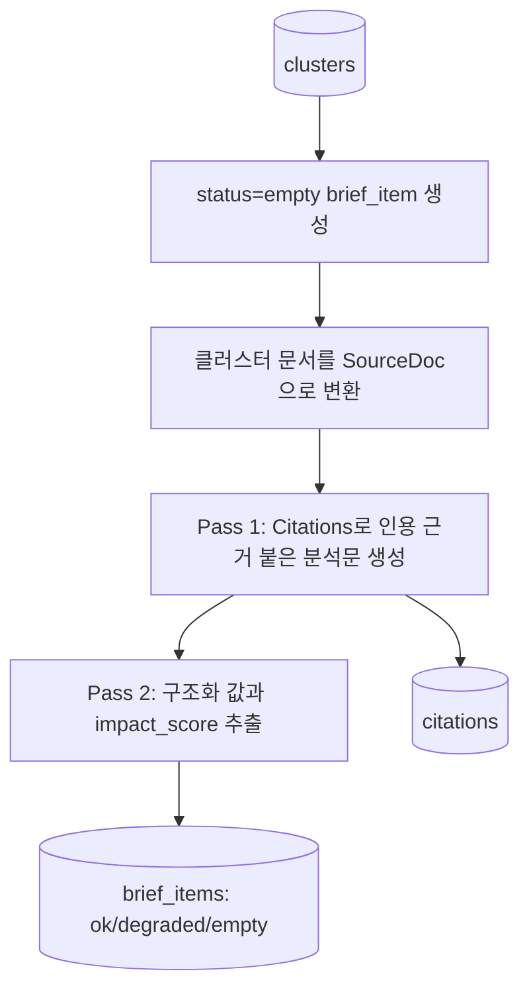
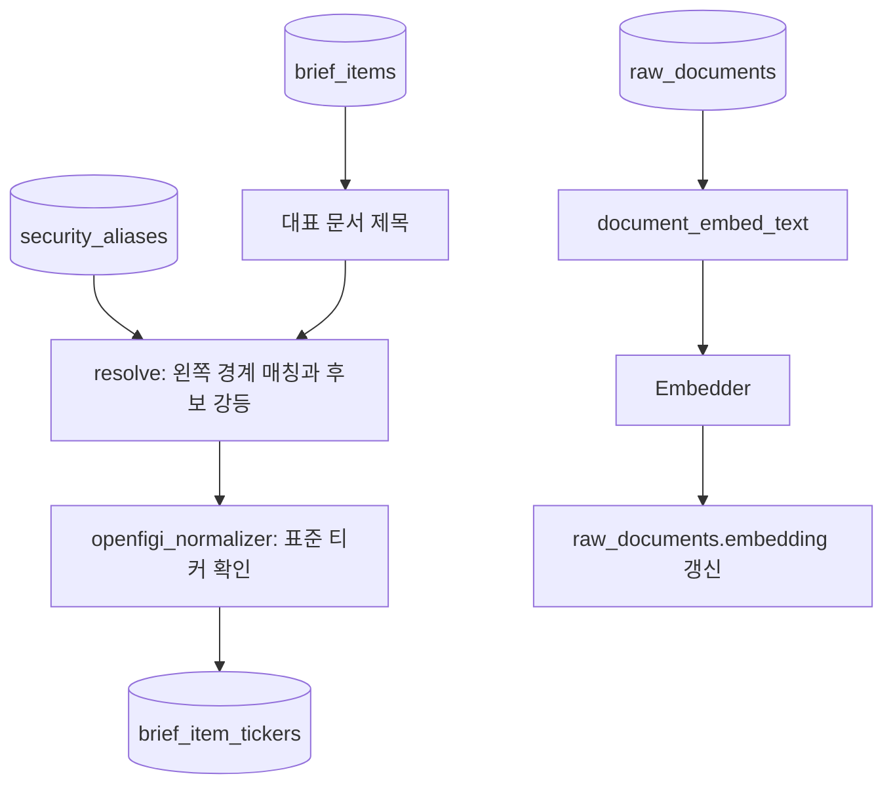
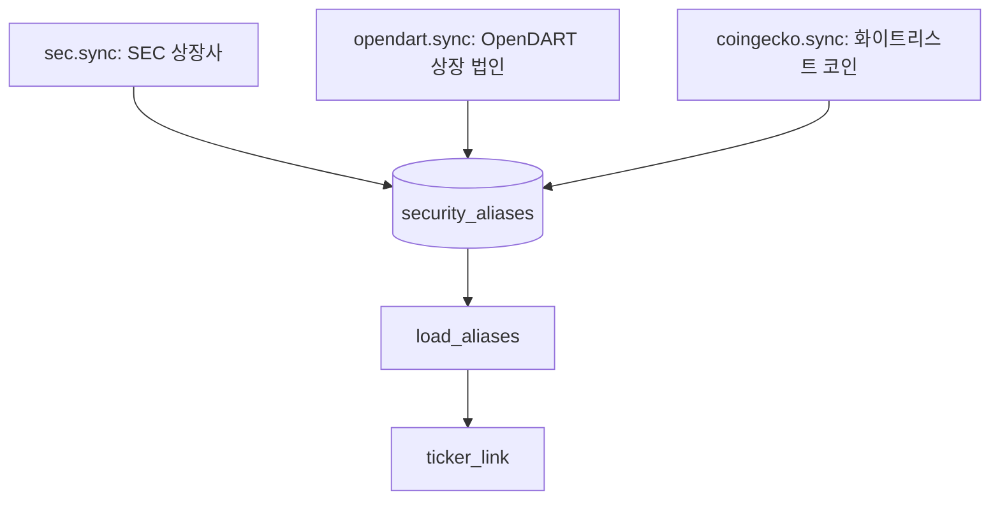

# 03. 영향 분석 파이프라인

## 한 줄 요약

분석 파이프라인은 `dedup -> cluster -> generate_impact -> analyze_impact -> ticker_link -> embed` 순서로 문서를 브리프, 인용 근거, 영향 점수, 종목 연결, 검색용 임베딩으로 바꾼다.

## 비개발자 설명

수집된 문서는 곧바로 화면에 나오지 않는다. 먼저 신선도 윈도우(기본 24시간, KST 기준일 종일에서 역산) 안의 문서만 골라 같은 기사나 거의 같은 제목을 묶고, 각 묶음마다 "분석할 항목"을 만든다. 그 다음 AI 분석기가 실제 문서에서 인용 가능한 근거를 찾았을 때만 분석문과 방향성, 신뢰도, 영향 점수(`impact_score`)를 채운다.

종목 연결은 AI가 직접 만들지 않는다. `security_aliases`에 들어 있는 별칭 사전과 OpenFIGI 확인을 통해 연결한다. 이는 모델이 존재하지 않는 종목명을 만들어내는 일을 줄이기 위한 구조다. 별칭 사전 자체도 코드에 박지 않고 SEC(미국)·OpenDART(한국)·CoinGecko(크립토) 공개 데이터를 동기화해 채운다. 여기서 나오는 종목 연결은 투자 권유가 아니라 "뉴스·공시 근거 기반 영향도 분석"의 산출물이다.

## 설계도

### 다이어그램 코드 매핑

| 설계도 박스 | 담당 코드 |
| --- | --- |
| `run_pipeline 시작` | `app/pipeline/pipeline.py::run_pipeline` |
| `advisory lock 획득/해제` | `app/pipeline/pipeline.py::run_pipeline`의 `_PIPELINE_LOCK_KEY`, `pg_try_advisory_lock` |
| `dedup` | `app/pipeline/pipeline.py::dedup`, `app/pipeline/dedup.py::near_duplicate_groups` |
| `cluster` | `app/pipeline/pipeline.py::cluster` |
| `generate_impact` | `app/pipeline/pipeline.py::generate_impact` |
| `analyze_impact` | `app/pipeline/pipeline.py::analyze_impact`, `app/pipeline/citations.py::anthropic_analyzer` |
| `ticker_link` | `app/pipeline/pipeline.py::ticker_link`, `app/pipeline/ticker_link.py::resolve`, `app/pipeline/ticker_link.py::openfigi_normalizer` |
| `embed_documents` | `app/pipeline/embed.py::embed_documents` |

## 코드/폴더 매핑

| 코드 | 하는 일 |
| --- | --- |
| [`app/pipeline/pipeline.py`](../../app/pipeline/pipeline.py) | 파이프라인 순서, KST 신선도 컷오프, DB 트랜잭션·락 관리 |
| [`app/pipeline/dedup.py`](../../app/pipeline/dedup.py) | SimHash 기반 제목 근접 중복 탐지 |
| [`app/pipeline/citations.py`](../../app/pipeline/citations.py) | 인용 근거 기반 2-pass 영향 분석(impact_score 포함) |
| [`app/pipeline/ticker_link.py`](../../app/pipeline/ticker_link.py) | 별칭 사전과 OpenFIGI 기반 종목 연결(경계 검사·후보 강등) |
| [`app/pipeline/openfigi.py`](../../app/pipeline/openfigi.py) | OpenFIGI /v3/mapping 클라이언트(429 재시도, 거래소 우선순위) |
| [`app/pipeline/seed.py`](../../app/pipeline/seed.py) | 유니버스 시딩 진입점(`seed_universe`, 소스 격리) |
| [`app/pipeline/sec.py`](../../app/pipeline/sec.py) | SEC company_tickers.json → US 별칭 동기화 |
| [`app/pipeline/opendart.py`](../../app/pipeline/opendart.py) | OpenDART corpCode.xml → KR 별칭 동기화 |
| [`app/pipeline/coingecko.py`](../../app/pipeline/coingecko.py) | CoinGecko /coins/list → 화이트리스트 크립토 별칭 동기화 |
| [`app/pipeline/embed.py`](../../app/pipeline/embed.py) | 검색용 문서 임베딩 저장 |
| [`app/embed/__init__.py`](../../app/embed/__init__.py) | 임베더 인터페이스와 문서 임베딩 텍스트 생성 |
| [`scripts/backfill_impact_score.py`](../../scripts/backfill_impact_score.py) | 컬럼 추가 이전 brief_items의 impact_score만 백필 |
| [`migrations/versions/0004_brief_item_impact_score.py`](../../migrations/versions/0004_brief_item_impact_score.py) | `brief_items.impact_score` 컬럼 추가(nullable 정수) |

## 단계별 설계도

### 1. 중복 제거와 클러스터 생성

| 박스 | 코드 |
| --- | --- |
| `_freshness_cutoff` | `app/pipeline/pipeline.py::_freshness_cutoff` |
| `_candidate_docs` | `app/pipeline/pipeline.py::_candidate_docs` |
| `near_duplicate_groups` | `app/pipeline/dedup.py::near_duplicate_groups` |
| `크기 2 이상 그룹 cluster 저장` | `app/pipeline/pipeline.py::dedup` |
| `1건짜리 cluster 저장` | `app/pipeline/pipeline.py::cluster` |

`dedup`은 제목 기반 64비트 SimHash의 해밍거리(기본 3 이하)로 가까운 문서를 union-find로 묶는다. 크기 2 이상 그룹만 클러스터가 되고, 이후 `cluster`가 아직 어떤 클러스터에도 속하지 않은 문서를 1건짜리 클러스터로 만든다. 이 덕분에 중복 기사도 하나의 사건으로 보고, 독립 기사도 빠뜨리지 않는다. `published_at`이 NULL인 문서는 신선도를 알 수 없으므로 배제하지 않고 후보에 포함한다.

### 2. 영향 분석 항목 생성과 근거 분석

| 박스 | 코드 |
| --- | --- |
| `status=empty brief_item 생성` | `app/pipeline/pipeline.py::generate_impact` |
| `SourceDoc으로 변환` | `app/pipeline/pipeline.py::_cluster_source_docs` |
| `Pass 1` | `app/pipeline/citations.py::anthropic_analyzer`, `parse_pass1` |
| `Pass 2` | `app/pipeline/citations.py::_pass2_input`, `_PASS2_SCHEMA` |
| `brief_items 저장` | `app/pipeline/pipeline.py::analyze_impact` |
| `citations 저장` | `app/models.py::Citation` |

분석기가 없으면(`anthropic_api_key` 미설정) 항목은 `empty`로 남고, API 오류가 있으면 `degraded`가 된다. 인용 근거가 0개면 분석문을 억지로 저장하지 않고 `empty`를 유지한다. 근거가 확인되면 `event_type`·`direction`·`confidence`·`impact_score`·`analysis_text`를 채우고 `status="ok"`로 바꾼다. `impact_score`는 마이그레이션 0004에서 추가된 컬럼이라 그 이전 분석분은 NULL인데, [`scripts/backfill_impact_score.py`](../../scripts/backfill_impact_score.py)가 기존 분석문·인용은 보존한 채 점수만 다시 계산해 채운다.

### 3. 종목 연결과 임베딩

| 박스 | 코드 |
| --- | --- |
| `대표 문서 제목` | `app/pipeline/pipeline.py::_representative_title` |
| `security_aliases` | `app/pipeline/pipeline.py::load_aliases`, `app/models.py::SecurityAlias` |
| `resolve` | `app/pipeline/ticker_link.py::resolve`, `_alias_occurs` |
| `openfigi_normalizer` | `app/pipeline/ticker_link.py::openfigi_normalizer`, `app/pipeline/openfigi.py::normalize` |
| `brief_item_tickers` | `app/models.py::BriefItemTicker` |
| `document_embed_text` | `app/embed/__init__.py::document_embed_text` |
| `Embedder` | `app/embed/__init__.py::Embedder`, `get_embedder` |
| `raw_documents.embedding 갱신` | `app/pipeline/embed.py::embed_documents` |

`resolve`는 별칭 매칭에 왼쪽 경계 검사를 쓴다 — 별칭 왼쪽에 문자·숫자가 붙으면 더 긴 단어의 일부('이닉스'가 '하이닉스' 안)라 매치하지 않고, 한국어 조사는 오른쪽에만 붙으므로 접미('테슬라가')는 허용한다. 2자 이하 짧은 별칭, 큐레이션 모호어(`_AMBIGUOUS_ALIASES`, 예: '오로라'), 여러 종목으로 가는 중의 별칭, OpenFIGI 확인 실패는 모두 버리지 않고 `is_candidate=True`(후보)로 강등한다 — 단정한 링크의 precision 게이트(95% 이상)를 지키기 위해서다. CRYPTO는 OpenFIGI 비대상이라 정규화를 건너뛴다.

`embed_documents`는 `embedding IS NULL`인 문서만 배치(64건)로 채우는 멱등 단계이며, 임베더가 주입되지 않으면 아무 것도 하지 않는다. `/trigger`는 빠른 분석 경로라 임베더를 넘기지 않고, 일일 실행(`run_daily`)만 `get_embedder()` 결과를 넘긴다.

### 4. 별칭 사전 시딩 (파이프라인 밖, run_daily 첫 단계)

| 박스 | 코드 |
| --- | --- |
| 시딩 진입점 | `app/pipeline/seed.py::seed_universe`, `seed_aliases` |
| `sec.sync` | `app/pipeline/sec.py::sync`, `fetch_company_tickers` |
| `opendart.sync` | `app/pipeline/opendart.py::sync`, `fetch_corp_codes` |
| `coingecko.sync` | `app/pipeline/coingecko.py::sync`, `fetch_universe_coins` |

`security_aliases`가 비면 `ticker_link`가 영구 0건이라, 일일 실행이 파이프라인 전에 `seed_universe`를 부른다. 세 시더는 소스 격리(try/except)로 묶여 한 소스의 키 부재·네트워크 장애가 나머지를 막지 않는다. SEC·OpenDART는 상장사 전체를 받지만 CoinGecko는 `_UNIVERSE` 화이트리스트(BTC/ETH/SOL + RWA 내러티브 토큰)만 적재한다 — 15,000개 전체 덤프는 심볼·이름 충돌로 별칭이 중의적이 되어 precision 게이트를 깨기 때문이다. 세 sync 모두 `ON CONFLICT DO NOTHING`으로 멱등하다.

## 왜 이렇게 만들었나

가장 중요한 설계 원칙은 "근거 없는 분석을 저장하지 않는다"이다. 그래서 먼저 빈 브리프 항목을 만들고, 근거가 확인된 경우에만 `status="ok"`로 바꾼다. 실패나 근거 부족도 상태값으로 남기기 때문에 화면에서 "분석 없음"과 "분석 실패"를 구분할 수 있다.

종목 연결을 분석문 생성 뒤에 둔 이유는 `brief_item_tickers`가 `brief_items`를 외래키로 참조하기 때문이다. 먼저 브리프 항목을 만들어야 종목 연결 결과를 안정적으로 붙일 수 있다. 영향 종목을 LLM이 아니라 사전+OpenFIGI로 결정하는 것도 같은 맥락 — 오귀속 하나가 추적성 신뢰 전체를 깬다.

실측으로 배운 것들이 코드 구조에 직접 반영돼 있다:

- **신선도 컷오프는 KST 앵커링.** `brief_date`는 KST 기준일인데 컷오프를 UTC 자정으로 잡았더니 KST 오전 수집분이 통째로 잘려 클러스터 0건·빈 다이제스트가 됐다(실측: 132건 수집에도 후보 0건). `_freshness_cutoff`가 종일 경계를 KST로 잡는 이유다.
- **advisory lock은 전용 연결에 고정.** `pg_try_advisory_lock`은 연결 단위 락이라, 작업 세션에서 잡고 커밋 뒤 풀면 언락이 다른 풀 연결에서 돌아 락이 누수됐다(후속 실행이 `PipelineAlreadyRunning`). `run_pipeline`이 `engine.connect()`로 연 전용 연결에서 잡고/풀고, 작업은 별도 세션에서 하는 이유다.
- **단계 사이 `session.flush()` 명시.** `SessionLocal`이 `autoflush=False`라, dedup이 `add`한 `ClusterMember`를 cluster가 못 보면 같은 문서가 중복 클러스터가 된다(dedup→cluster (4,4) 회귀 실측). 쓴 단계 끝에서 flush하고 커밋은 `run_pipeline`이 일괄 처리한다.
- **신규 적재 수는 RETURNING으로 센다.** `ON CONFLICT DO NOTHING`의 `rowcount`는 -1(신뢰 불가)을 반환한다(실측: 3,971건 적재에도 -1). 세 시더가 모두 `.returning()`으로 실제 삽입 행을 세는 이유다.
- **외부 HTTPS는 truststore.** 사내 TLS 가로채기 환경에서 기본 인증서 검증이 `CERTIFICATE_VERIFY_FAILED`로 죽으므로, OpenFIGI·OpenDART·SEC·CoinGecko 클라이언트 모두 OS 인증서 저장소를 신뢰하는 `truststore.SSLContext`를 쓴다.
- **응답이 ZIP이라고 믿지 않는다.** OpenDART는 에러 상황에서도 ZIP 대신 에러 XML을 200으로 반환할 수 있어, `fetch_corp_codes`가 `BadZipFile`을 잡아 `OpenDARTError`로 바꾼다(공시 원문 수집기의 ZIP 매직 검사와 같은 계열의 교훈).
- **API 키 노출 방지.** OpenDART는 키를 쿼리스트링(`crtfc_key`)으로 받는데 httpx INFO 로깅이 URL을 통째로 찍는다. `app/pipeline/opendart.py::main`이 httpx 로거를 WARNING으로 억제하는 이유다.
- **`impact_score` 범위는 프롬프트로 강제.** Anthropic structured output의 JSON 스키마는 integer의 minimum/maximum을 거부(400)하므로, `_PASS2_SCHEMA`는 `{"type": "integer"}`만 두고 범위는 프롬프트에서 지시한다.

## 관련 테스트

| 테스트 파일 | 막는 사고 |
| --- | --- |
| [`tests/test_pipeline.py`](../../tests/test_pipeline.py) | 클러스터·브리프·인용 저장 순서 오류, 재실행 멱등성 깨짐, degraded/ok 상태 전이 오류 |
| [`tests/test_dedup.py`](../../tests/test_dedup.py) | 비슷한 제목을 놓치거나 무관한 제목을 묶는 오류 |
| [`tests/test_ticker_link.py`](../../tests/test_ticker_link.py) | 경계 검사·후보 강등·정규화 실패 처리 등 종목 연결 규칙 위반 |
| [`tests/test_ticker_precision.py`](../../tests/test_ticker_precision.py) | 단정 링크의 precision 게이트(0.95 이상) 미달 |
| [`tests/test_seed.py`](../../tests/test_seed.py) | 한 시더 실패가 나머지를 막는 오류, coverage 시드 멱등성 깨짐 |
| [`tests/test_openfigi.py`](../../tests/test_openfigi.py) | OpenFIGI 매핑 파싱, 429 재시도, 거래소 우선순위, 타임아웃 처리 오류 |
| [`tests/test_coingecko.py`](../../tests/test_coingecko.py) | 화이트리스트 밖 코인 적재, 심볼 정규화 오류 |
| [`tests/test_sec.py`](../../tests/test_sec.py) | UA 미설정 호출, 비-JSON 응답(차단 페이지) 오적재 |
| [`tests/test_opendart.py`](../../tests/test_opendart.py) | 키 미설정 호출, 비상장 법인 적재, 에러 XML을 ZIP으로 오인 |

## 다음에 읽을 문서

1. [04. 인용과 AI 분석](./04-citations-and-ai-analysis.md)
