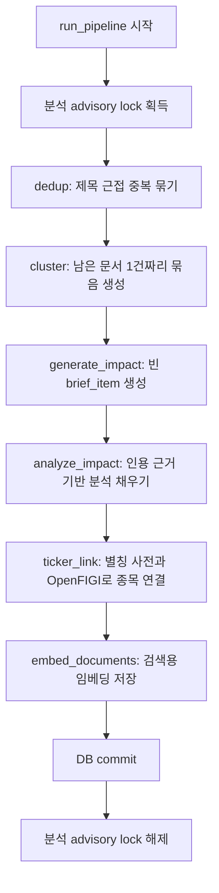
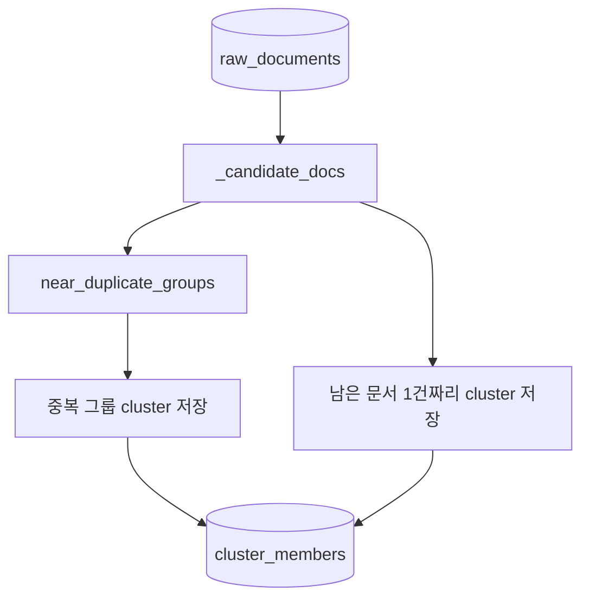
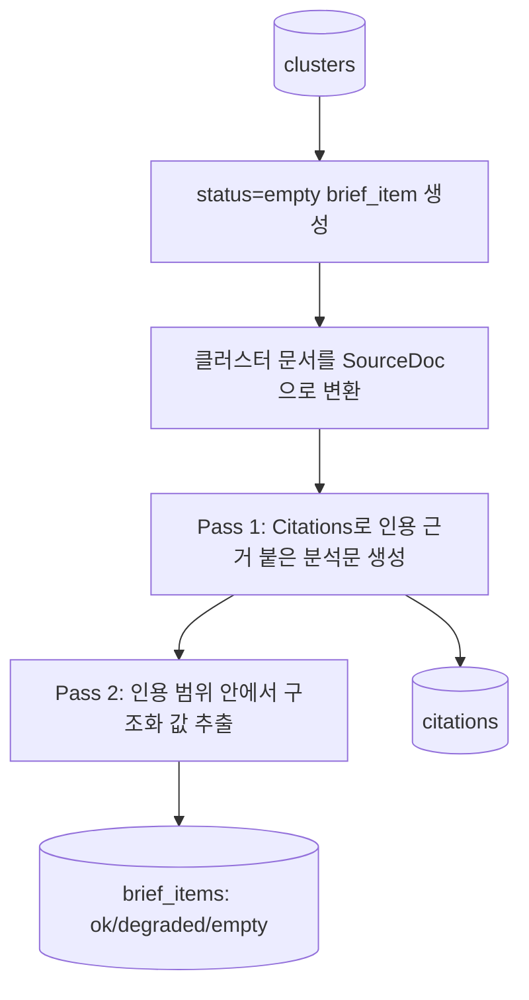
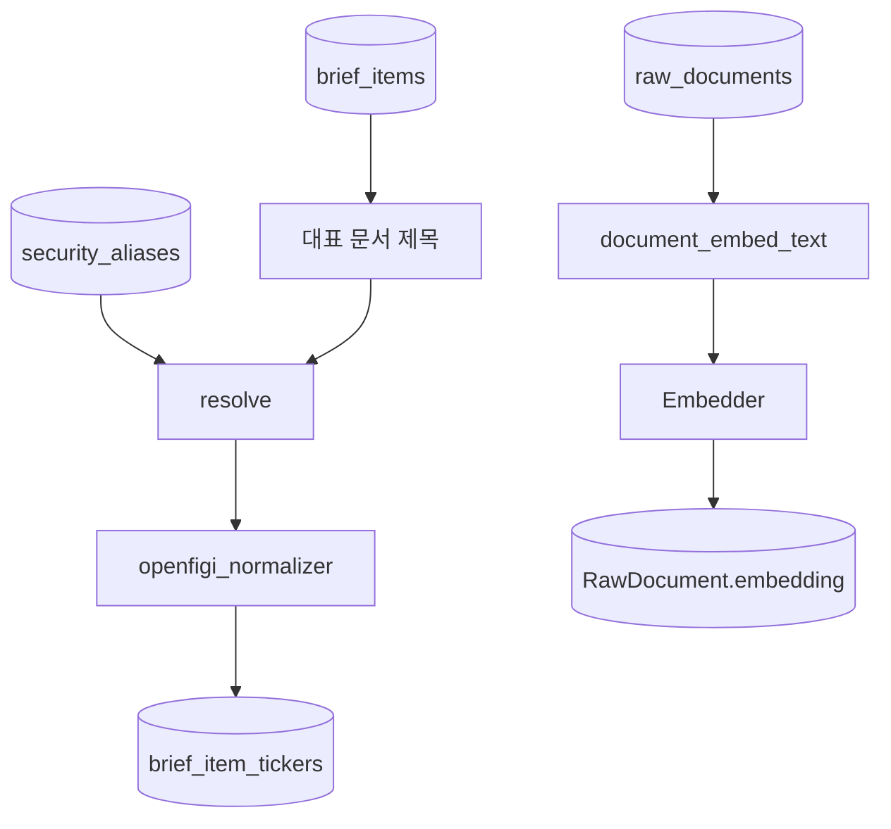

# 03. 영향 분석 파이프라인

## 한 줄 요약

분석 파이프라인은 `dedup -> cluster -> generate_impact -> analyze_impact -> ticker_link -> embed` 순서로 문서를 브리프, 인용 근거, 종목 연결, 검색용 임베딩으로 바꾼다.

## 비개발자 설명

수집된 문서는 곧바로 화면에 나오지 않는다. 먼저 같은 기사나 거의 같은 제목을 묶고, 각 묶음마다 "분석할 항목"을 만든다. 그 다음 AI 분석기가 실제 문서에서 인용 가능한 근거를 찾았을 때만 분석문과 방향성, 신뢰도, 영향 점수를 채운다.

종목 연결은 AI가 직접 만들지 않는다. `security_aliases`에 들어 있는 별칭 사전과 OpenFIGI 확인을 통해 연결한다. 이는 모델이 존재하지 않는 종목명을 만들어내는 일을 줄이기 위한 구조다.

## 설계도

### 다이어그램 코드 매핑

| 설계도 박스 | 담당 코드 |
| --- | --- |
| `run_pipeline 시작` | [`app/pipeline/pipeline.py`](../../app/pipeline/pipeline.py)의 `run_pipeline` |
| `분석 advisory lock 획득` | `app.pipeline.pipeline::_PIPELINE_LOCK_KEY`, `pg_try_advisory_lock` |
| `dedup` | `app.pipeline.pipeline::dedup`, [`app/pipeline/dedup.py`](../../app/pipeline/dedup.py)의 `near_duplicate_groups` |
| `cluster` | `app.pipeline.pipeline::cluster` |
| `generate_impact` | `app.pipeline.pipeline::generate_impact` |
| `analyze_impact` | `app.pipeline.pipeline::analyze_impact`, [`app/pipeline/citations.py`](../../app/pipeline/citations.py)의 `ImpactAnalyzer` |
| `ticker_link` | `app.pipeline.pipeline::ticker_link`, [`app/pipeline/ticker_link.py`](../../app/pipeline/ticker_link.py)의 `resolve`, `openfigi_normalizer` |
| `embed_documents` | [`app/pipeline/embed.py`](../../app/pipeline/embed.py)의 `embed_documents` |

## 단계별 설계도

### 1. 중복 제거와 클러스터 생성

| 박스 | 코드 |
| --- | --- |
| `_candidate_docs` | `app.pipeline.pipeline::_candidate_docs` |
| `near_duplicate_groups` | `app.pipeline.dedup::near_duplicate_groups` |
| `중복 그룹 cluster 저장` | `app.pipeline.pipeline::dedup` |
| `1건짜리 cluster 저장` | `app.pipeline.pipeline::cluster` |

`dedup`은 제목 기반 SimHash로 가까운 문서를 먼저 묶는다. 이후 `cluster`는 아직 어떤 클러스터에도 속하지 않은 문서를 1건짜리 클러스터로 만든다. 이 덕분에 중복 기사도 하나의 사건으로 보고, 독립 기사도 빠뜨리지 않는다.

### 2. 영향 분석 항목 생성과 근거 분석

| 박스 | 코드 |
| --- | --- |
| `status=empty brief_item 생성` | `app.pipeline.pipeline::generate_impact` |
| `SourceDoc으로 변환` | `app.pipeline.pipeline::_cluster_source_docs` |
| `Pass 1` | `app.pipeline.citations::anthropic_analyzer`, `parse_pass1` |
| `Pass 2` | `app.pipeline.citations::_pass2_input`, `_PASS2_SCHEMA` |
| `brief_items 저장` | `app.pipeline.pipeline::analyze_impact` |
| `citations 저장` | `app.models::Citation` |

분석기가 없거나 API 오류가 있으면 항목은 `empty` 또는 `degraded` 상태로 남는다. 인용 근거가 0개면 분석문을 억지로 저장하지 않는다.

### 3. 종목 연결과 임베딩

| 박스 | 코드 |
| --- | --- |
| `대표 문서 제목` | `app.pipeline.pipeline::_representative_title` |
| `security_aliases` | `app.pipeline.pipeline::load_aliases`, `app.models::SecurityAlias` |
| `resolve` | `app.pipeline.ticker_link::resolve` |
| `openfigi_normalizer` | `app.pipeline.ticker_link::openfigi_normalizer` |
| `brief_item_tickers` | `app.models::BriefItemTicker` |
| `document_embed_text` | `app.embed::document_embed_text` |
| `Embedder` | `app.embed::Embedder`, `app.embed::get_embedder` |
| `RawDocument.embedding` | `app.pipeline.embed::embed_documents` |

`embed_documents`는 임베더가 주입되지 않으면 아무 것도 하지 않는다. `/trigger`는 기본적으로 빠른 분석 경로라 임베더를 넘기지 않고, 일일 실행은 `get_embedder()` 결과를 넘긴다.

## 코드/폴더 매핑

| 코드 | 하는 일 |
| --- | --- |
| [`app/pipeline/pipeline.py`](../../app/pipeline/pipeline.py) | 파이프라인 순서와 DB 트랜잭션 관리 |
| [`app/pipeline/dedup.py`](../../app/pipeline/dedup.py) | SimHash 기반 제목 근접 중복 탐지 |
| [`app/pipeline/citations.py`](../../app/pipeline/citations.py) | 인용 근거 기반 2-pass 영향 분석 |
| [`app/pipeline/ticker_link.py`](../../app/pipeline/ticker_link.py) | 별칭 사전과 OpenFIGI 기반 종목 연결 |
| [`app/pipeline/embed.py`](../../app/pipeline/embed.py) | 검색용 문서 임베딩 저장 |
| [`app/embed/__init__.py`](../../app/embed/__init__.py) | 임베더 인터페이스와 문서 임베딩 텍스트 생성 |

## 왜 이렇게 만들었나

가장 중요한 설계 원칙은 "근거 없는 분석을 저장하지 않는다"이다. 그래서 먼저 빈 브리프 항목을 만들고, 근거가 확인된 경우에만 `status="ok"`로 바꾼다. 실패나 근거 부족도 상태값으로 남기기 때문에 화면에서 "분석 없음"과 "분석 실패"를 구분할 수 있다.

종목 연결을 분석문 생성 뒤에 둔 이유는 `brief_item_tickers`가 `brief_items`를 외래키로 참조하기 때문이다. 먼저 브리프 항목을 만들어야 종목 연결 결과를 안정적으로 붙일 수 있다.

## 관련 테스트

| 테스트 파일 | 막는 사고 |
| --- | --- |
| [`tests/test_dedup.py`](../../tests/test_dedup.py) | 비슷한 제목을 놓치거나 무관한 제목을 묶는 오류 |
| [`tests/test_pipeline.py`](../../tests/test_pipeline.py) | 클러스터, 브리프, 인용 저장 순서 오류 |
| [`tests/test_citations.py`](../../tests/test_citations.py) | 인용 범위 매핑과 2-pass 분석 계약 위반 |
| [`tests/test_ticker_link.py`](../../tests/test_ticker_link.py) | 별칭 기반 종목 연결과 후보 표시 오류 |
| [`tests/test_openfigi.py`](../../tests/test_openfigi.py) | OpenFIGI 확인 호출, 429 재시도, 거래소 우선순위 오류 |
| [`tests/test_embed.py`](../../tests/test_embed.py) | 임베딩 저장의 멱등성과 no-op 처리 |

## 다음에 읽을 문서

1. [04. 인용과 AI 분석](./04-citations-and-ai-analysis.md)
2. [07. 데이터 모델](./07-data-model.md)
