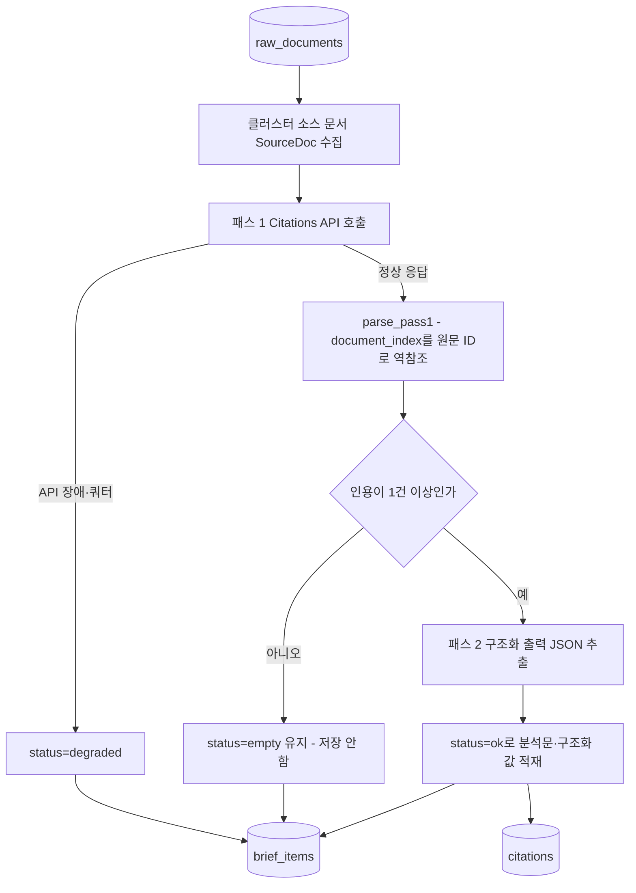

# 04. 인용과 AI 분석

## 한 줄 요약

AI 분석은 2-pass 구조다. 먼저 인용 근거가 붙은 분석문을 만들고, 그 다음 인용된 범위 안에서만 구조화된 값을 추출한다.

## 비개발자 설명

이 프로젝트에서 AI는 자유롭게 전망을 만들어내는 역할이 아니다. 클러스터에 묶인 뉴스 문서의 제목과 요약을 입력받고, 응답의 문장마다 실제 인용 근거가 붙었는지 확인한다. 인용 근거가 하나도 없으면 분석 결과를 저장하지 않고 브리프를 빈 상태로 남긴다.

인용이 붙은 경우에만 두 번째 단계로 넘어가 `event_type`, `direction`, `confidence`, `impact_score` 같은 화면용 값을 뽑는다. 두 번째 단계에는 원문 전체가 아니라 첫 번째 단계에서 실제로 인용된 텍스트 범위만 넣는다. 새 사실이나 수치를 끼워 넣을 입력 자체가 없는 셈이다.

영향 종목(티커)은 AI가 정하지 않는다. 사전(별칭 테이블) 기반의 별도 단계(ticker_link)가 결정한다. 그리고 이 모든 결과는 투자 권유가 아니라 "뉴스 근거 기반 영향도 해석"으로만 취급한다 — 시스템 프롬프트에도 그렇게 명시돼 있다.

## 설계도

### 다이어그램 코드 매핑

| 설계도 박스 | 담당 코드 |
| --- | --- |
| 클러스터 소스 문서 SourceDoc 수집 | `app/pipeline/pipeline.py::_cluster_source_docs`, `app/pipeline/citations.py::SourceDoc` |
| 패스 1 Citations API 호출 | `app/pipeline/citations.py::anthropic_analyzer`, `app/pipeline/citations.py::_build_documents` |
| parse_pass1 | `app/pipeline/citations.py::parse_pass1` |
| 패스 2 구조화 출력 JSON 추출 | `app/pipeline/citations.py::_pass2_input`, `_PASS2_SCHEMA` |
| status=ok/empty/degraded 적재 | `app/pipeline/pipeline.py::analyze_impact` |
| brief_items / citations | `app/models.py::BriefItem`, `app/models.py::Citation` |

## 코드/폴더 매핑

| 코드 | 역할 |
| --- | --- |
| [`app/pipeline/citations.py`](../../app/pipeline/citations.py) | 영향 분석용 2-pass Citations 처리. 순수 함수(`parse_pass1` 등)와 I/O(`anthropic_analyzer`) 분리 |
| `SourceDoc` | 패스 1에 넘기는 클러스터 문서 단위(제목+요약, 본문은 법적 경계로 미포함) |
| `CitedSpan` | 실제 인용된 텍스트와 원문 문서 ID·문자 범위·발행시각 |
| `ImpactResult` | 분석문, 인용 목록, `event_type`, `direction`, `confidence`, `impact_score`(0~100, 부호 없음) |
| `build_client` | truststore로 OS 인증서를 신뢰하는 Anthropic 클라이언트(사내 TLS 대응). 다이제스트·채팅도 재사용 |
| [`app/pipeline/pipeline.py`](../../app/pipeline/pipeline.py) | `analyze_impact`가 status=empty 브리프만 골라 분석기를 호출하고 결과를 적재 |
| [`app/pipeline/digest.py`](../../app/pipeline/digest.py) | 일일 다이제스트도 같은 2-pass 원칙(`anthropic_digester`) — 입력이 그날 ok 브리프의 `cited_text`뿐 |
| [`app/web/chat.py`](../../app/web/chat.py) | 날짜별 채팅(`anthropic_chat`)과 누적 RAG 채팅(`anthropic_rag_chat`) — 인용 0이면 답변 거부 |
| [`app/config.py`](../../app/config.py) | `anthropic_api_key`(없으면 분석 비활성), `impact_model`(기본 `claude-opus-4-8`, 네 흐름이 공유) |

## Anthropic API를 쓰는 방식

- **패스 1 — Citations API**: user content에 `{"type": "document", "citations": {"enabled": true}}` 블록들을 넣어 호출한다. 블록 순서가 곧 응답의 `document_index`가 되므로, `parse_pass1`이 그 인덱스로 보낸 문서 목록을 역참조해 `raw_document_id`와 발행시각을 붙인다. `thinking={"type": "adaptive"}`로 추론을 켠다.
- **패스 2 — Structured Outputs**: `output_config={"format": {"type": "json_schema", "schema": ...}}`로 JSON 스키마를 강제한다. Citations와 Structured Outputs는 **한 콜에서 동시 사용 불가(400)** 라서 2-pass로 분리했다.
- **무결성 규칙**: 패스 2 입력은 패스 1 분석문 + 실제 인용된 `cited_text` 목록뿐이다(`_pass2_input`). 원문 문서를 다시 주지 않으므로 인용 범위 밖의 새 사실·수치가 끼어들 수 없다.
- **실패 처리**: `anthropic.APIError`는 None 반환 → 호출자가 `status="degraded"`로 기록. 다이제스트는 `json.JSONDecodeError`(패스 2 JSON 잘림)도 degraded로 처리한다.

## 영향 분석, 다이제스트, 채팅의 공통 원칙

| 흐름 | 입력 근거 | 결과 |
| --- | --- | --- |
| 영향 분석 | 클러스터에 속한 `RawDocument.title`, `RawDocument.summary` | `BriefItem`, `Citation` |
| 일일 다이제스트 | `status="ok"`인 `BriefItem`의 `Citation.cited_text` | `DailyDigest`, `DigestSource` |
| 날짜별 채팅 | 선택 날짜의 `BriefView.citations` | `ChatAnswer` |
| 누적 RAG 채팅 | 임베딩 검색(`search_citation_spans`, top_k=8)으로 찾은 `CitationView` | `ChatAnswer` |

판정 기준은 항상 같다: **모델이 실제로 인용했는가**. LLM이 그럴듯한 텍스트를 만들어도 인용이 0이면 영향 분석은 empty 유지, 다이제스트는 빈 다이제스트, 채팅은 "관련 근거 없음" 거부다. 채팅은 다이제스트·영향 분석과 달리 구조화가 필요 없어 패스 2 없이 Citations 1-pass만 쓴다. 또 채팅의 인용 대상은 1차 근거(`cited_text`)뿐이고 LLM 생성물인 `analysis_text`는 인용 대상에 넣지 않는다 — 생성물을 근거로 재인용하는 순환을 막는다.

## 왜 이렇게 만들었나

- **2-pass 분리**: Anthropic API가 Citations와 Structured Outputs를 한 콜에서 허용하지 않는다(400). 어차피 분리해야 한다면, 패스 2 입력을 "이미 인용으로 검증된 범위"로 좁혀 zero-fabrication 무결성 규칙을 공짜로 얻는다.
- **impact_score 스키마에 minimum/maximum이 없는 이유**: Anthropic structured output은 integer의 `minimum`/`maximum`을 지원하지 않아 넣으면 400이 난다. 실측에서는 이 400을 `except APIError`가 조용히 삼켜 점수가 전부 NULL로 저장되는 사고가 있었다. 그래서 범위(0~100)는 `_PASS2_SYSTEM` 프롬프트로 지시하고, 스키마에 bounds가 다시 들어가지 않도록 테스트로 고정했다.
- **LLM JSON을 신뢰하지 않는다**: 브리프가 많은 날 패스 2 JSON이 max_tokens에 잘려 `json.JSONDecodeError`(APIError가 아님)가 났다. 다이제스트는 max_tokens를 4096으로 올리고, 파싱 실패는 degraded로 강등해 daily_run 전체를 죽이지 않는다. 또 모델이 같은 section 키를 여러 번 돌려줘 unique 제약(`uq_daily_digests_date_section`)을 위반할 수 있어 적재 전에 키별로 병합한다.
- **truststore 클라이언트**: 사내 TLS 가로채기 환경에서 기본 인증서 검증이 `CERTIFICATE_VERIFY_FAILED`로 죽는다. `build_client`가 `truststore.SSLContext`를 주입한 httpx 클라이언트로 Anthropic을 만들고, 다이제스트·채팅·RAG가 모두 이 하나를 재사용한다.
- **순수/I-O 분리**: `parse_pass1`·`_parse_chat` 같은 파싱은 네트워크·DB 없이 더미 객체로 테스트한다. SDK 타입에 묶이지 않게 `getattr`로 방어적으로 접근한다.
- **티커는 LLM이 아닌 사전이 결정**: 유니버스(어떤 종목을 다루는지)는 설정·DB 상태의 경계이지 모델 출력이 아니다. LLM이 임의 종목을 "발명"하는 것을 구조적으로 차단한다.

## 관련 테스트

| 테스트 파일 | 막는 사고 |
| --- | --- |
| [`tests/test_citations.py`](../../tests/test_citations.py) | 패스 1 인용→원문 매핑 오류, 범위 밖 `document_index`, 패스 2 입력 범위 초과, API 오류 미처리, 스키마에 미지원 integer bounds 재유입 |
| [`tests/test_digest.py`](../../tests/test_digest.py) | 인용 0인데 다이제스트를 만들거나, JSON 잘림·중복 section 키로 적재가 깨지는 사고 |
| [`tests/test_web.py`](../../tests/test_web.py) | 날짜별 채팅이 인용 없이 답하거나 인용 링크 매핑이 틀어지는 사고 |
| [`tests/test_rag_chat.py`](../../tests/test_rag_chat.py) | 누적 RAG 채팅이 검색 근거 없이 답하거나 유사도 정렬·top_k가 깨지는 사고 |
| [`tests/test_swap.py`](../../tests/test_swap.py) | citation 텍스트와 원문 span 매핑이 뒤바뀌는 사고 |

## 다음에 읽을 문서

1. [05. 다이제스트와 RAG](./05-digest-and-rag.md)
