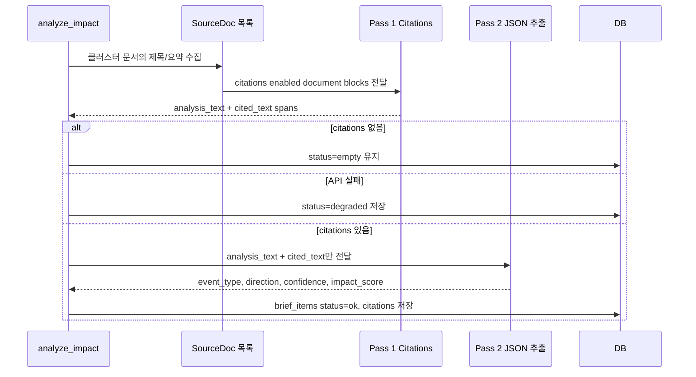
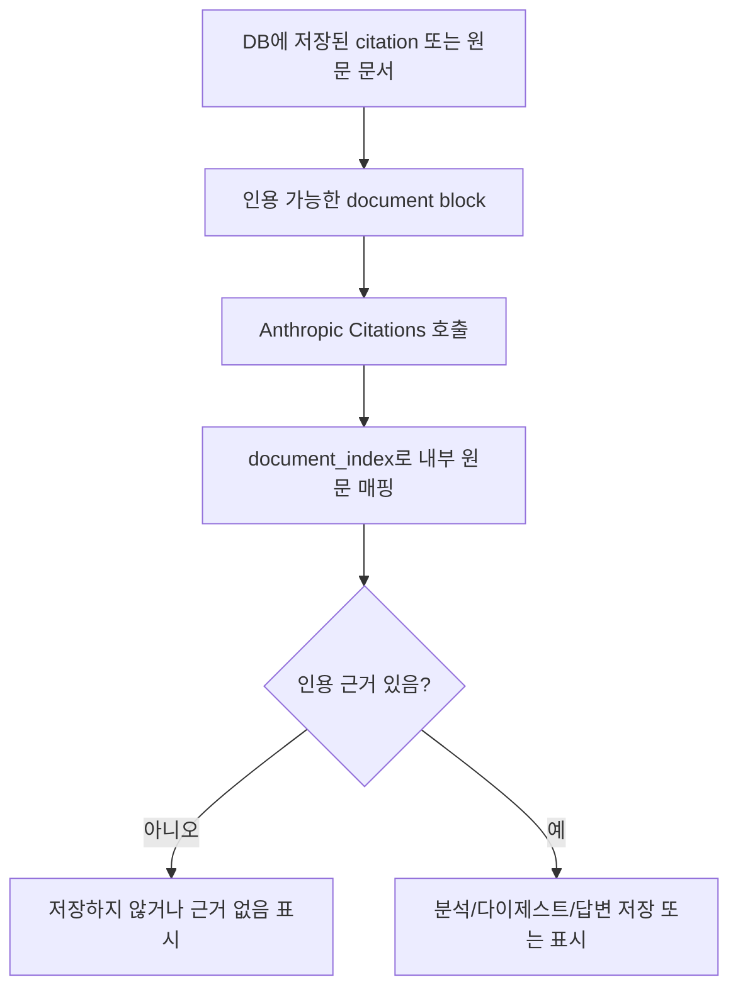

# 04. 인용과 AI 분석

## 한 줄 요약

AI 분석은 2-pass 구조다. 먼저 인용 근거가 붙은 분석문을 만들고, 그 다음 인용된 범위 안에서만 구조화된 값을 추출한다.

## 비개발자 설명

이 프로젝트에서 AI는 자유롭게 전망을 만들어내는 역할이 아니다. 먼저 문서 제목과 요약을 입력받고, 응답에 실제 인용 근거가 붙었는지 확인한다. 인용 근거가 없으면 분석 결과를 저장하지 않는다.

이후 두 번째 단계에서만 `event_type`, `direction`, `confidence`, `impact_score` 같은 화면용 값을 뽑는다. 두 번째 단계에는 원문 전체가 아니라 첫 번째 단계에서 실제로 인용된 텍스트 범위만 넣는다.

## 설계도

### 다이어그램 코드 매핑

| 설계도 박스 | 담당 코드 |
| --- | --- |
| `analyze_impact` | [`app/pipeline/pipeline.py`](../../app/pipeline/pipeline.py)의 `analyze_impact` |
| `SourceDoc 목록` | `app.pipeline.pipeline::_cluster_source_docs`, `app.pipeline.citations::SourceDoc` |
| `Pass 1 Citations` | `app.pipeline.citations::anthropic_analyzer`, `_build_documents`, `parse_pass1` |
| `Pass 2 JSON 추출` | `app.pipeline.citations::_pass2_input`, `_PASS2_SCHEMA` |
| `status=empty/degraded/ok` | `app.models::BriefItem` |
| `citations 저장` | `app.models::Citation` |

## 코드/폴더 매핑

| 코드 | 역할 |
| --- | --- |
| [`app/pipeline/citations.py`](../../app/pipeline/citations.py) | 영향 분석용 2-pass Citations 처리 |
| `SourceDoc` | Pass 1에 넘기는 클러스터 문서 단위 |
| `CitedSpan` | 실제 인용된 텍스트와 원문 문서 ID |
| `ImpactResult` | 분석문, 인용 목록, 이벤트 유형, 방향성, 신뢰도, 영향 점수 |
| `parse_pass1` | Anthropic 응답의 `document_index`를 내부 `raw_document_id`로 매핑 |
| `_pass2_input` | Pass 2 입력을 Pass 1 분석문과 인용 텍스트로 제한 |
| [`app/pipeline/digest.py`](../../app/pipeline/digest.py) | 일일 다이제스트도 같은 2-pass 원칙으로 생성 |
| [`app/web/chat.py`](../../app/web/chat.py) | 화면 채팅과 누적 RAG 채팅도 인용된 근거가 없으면 답변 거절 |

## 영향 분석, 다이제스트, 채팅의 공통 원칙

| 흐름 | 입력 근거 | 결과 |
| --- | --- | --- |
| 영향 분석 | 클러스터에 속한 `RawDocument.title`, `RawDocument.summary` | `BriefItem`, `Citation` |
| 일일 다이제스트 | `status="ok"`인 `BriefItem`의 `Citation.cited_text` | `DailyDigest`, `DigestSource` |
| 날짜별 채팅 | 선택 날짜의 `BriefView.citations` | `ChatAnswer` |
| 누적 RAG 채팅 | 임베딩 검색으로 찾은 `CitationView` | `ChatAnswer` |

## 왜 이렇게 만들었나

AI에게 원문 전체와 JSON 스키마를 동시에 주면 구조화는 편하지만, 어떤 문장이 실제 근거인지 추적하기 어려워진다. 이 코드는 인용 생성과 JSON 구조화를 분리한다. Pass 1은 "근거가 붙은 분석문"을 만들고, Pass 2는 "이미 근거가 붙은 범위 안에서 화면에 필요한 값만 뽑기"를 담당한다.

이 방식은 근거 없는 주장을 줄이기 위한 운영 장치다. 모델이 텍스트를 만들었더라도 인용이 없으면 `status="ok"`로 저장하지 않는다.

## 관련 테스트

| 테스트 파일 | 막는 사고 |
| --- | --- |
| [`tests/test_citations.py`](../../tests/test_citations.py) | Pass 1 인용 매핑 오류, Pass 2 입력 범위 초과, API 오류 처리 누락 |
| [`tests/test_digest.py`](../../tests/test_digest.py) | 다이제스트가 인용되지 않은 텍스트를 근거처럼 사용하는 사고 |
| [`tests/test_web.py`](../../tests/test_web.py) | 날짜별 채팅이 인용 없이 답하는 사고 |
| [`tests/test_rag_chat.py`](../../tests/test_rag_chat.py) | 누적 RAG 채팅이 검색 근거 없이 답하는 사고 |
| [`tests/test_swap.py`](../../tests/test_swap.py) | citation 텍스트와 원문 span 매핑이 뒤바뀌는 사고 |

## 다음에 읽을 문서

1. [05. 다이제스트와 RAG](./05-digest-and-rag.md)
2. [06. 대시보드와 채팅 UI](./06-dashboard-and-chat-ui.md)
