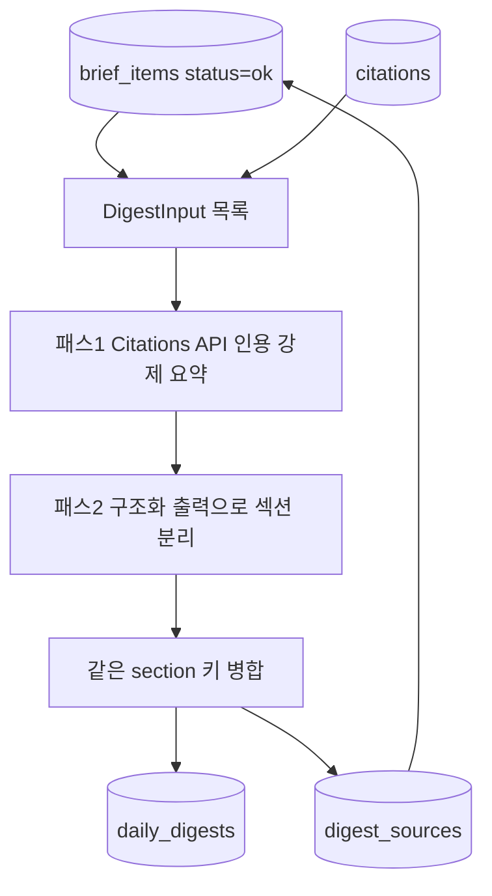
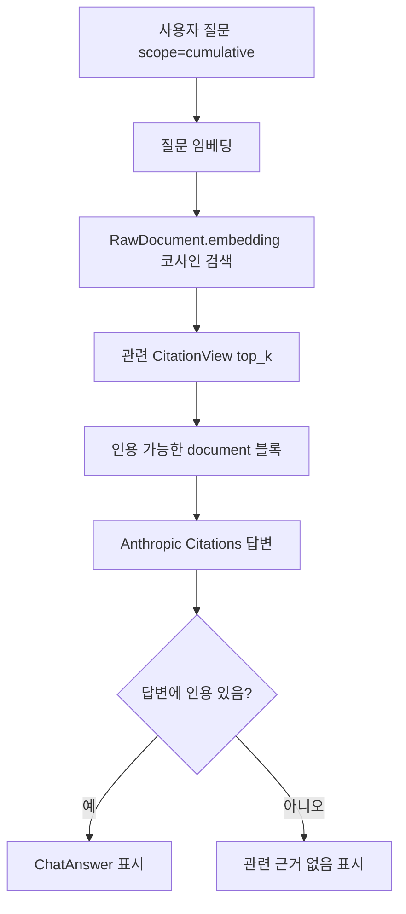
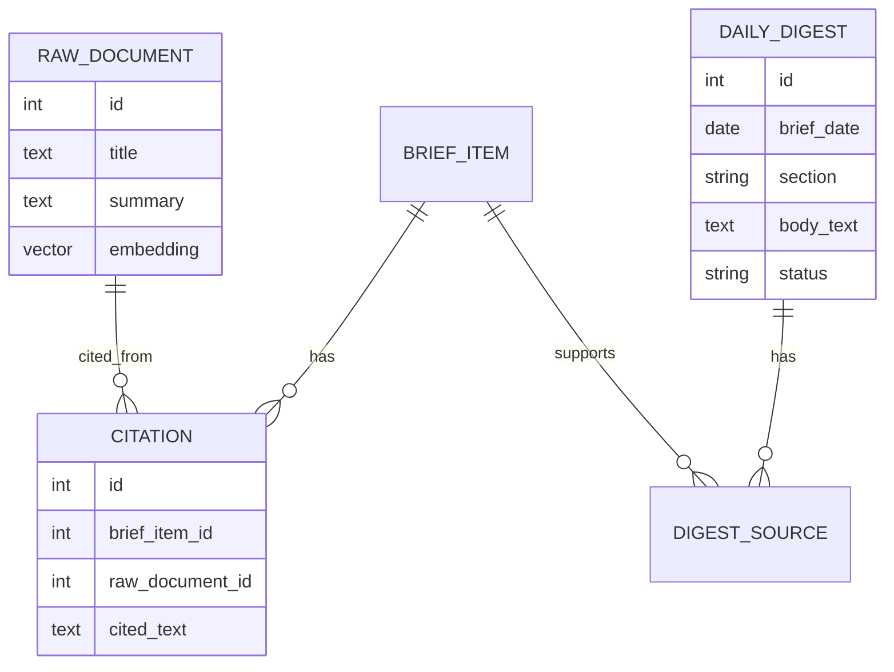

# 05. 다이제스트와 RAG

## 한 줄 요약

일일 다이제스트는 그날 `status="ok"` 브리프의 인용 근거만 집계해 거시·섹터 섹션으로 요약하고, 누적 RAG 채팅은 임베딩 검색으로 날짜를 넘나드는 과거 인용 근거를 찾아 그 안에서만 답한다.

## 비개발자 설명

대시보드의 다이제스트는 자유로운 시황 요약이 아니라 **집계**다. 그날 검증되어 `status="ok"`로 저장된 브리프와 그 브리프의 인용 근거(cited_text)만 입력으로 쓰고, 인용으로 뒷받침되지 않는 문장은 만들지 않는다. 요약 문장이 어떤 브리프에서 나왔는지는 `digest_sources`로 역추적할 수 있다. 근거가 하나도 없는 날은 환각으로 채우는 대신 "오늘은 추적 가능한 근거가 없습니다"라는 정직한 빈 다이제스트를 남긴다.

채팅은 두 가지 모드가 있다.

- 날짜별 채팅: 현재 선택한 날짜의 브리프 인용 근거만 사용한다.
- 누적 채팅: 과거 전체 문서 중 질문과 가까운 것을 임베딩으로 검색한 뒤, 그 문서에 연결된 인용 근거 안에서만 답한다.

두 모드 모두 답변에 인용이 하나도 없으면 답을 지어내지 않고 "관련 근거 없음"으로 거부한다.

## 설계도: 일일 다이제스트

### 다이어그램 코드 매핑

| 설계도 박스 | 담당 코드 |
| --- | --- |
| `brief_items status=ok` | `app/pipeline/digest.py::_ok_inputs` |
| `DigestInput 목록` | `app/pipeline/digest.py::DigestInput` |
| `패스1 Citations API 인용 강제 요약` | `app/pipeline/digest.py::anthropic_digester`, `parse_pass1` |
| `패스2 구조화 출력으로 섹션 분리` | `app/pipeline/digest.py::_pass2_input`, `_PASS2_SCHEMA` |
| `같은 section 키 병합` | `app/pipeline/digest.py::build_digest` |
| `daily_digests` | `app/models.py::DailyDigest` |
| `digest_sources` | `app/models.py::DigestSource` |

패스 구조는 04 문서의 영향 분석과 같은 2-pass 경계를 재사용한다. 패스 1은 brief_item별 cited_text 모음을 인용 가능한 document 블록으로 먹여 "거시 테마 / 영향 섹터 후보" 요약을 인용 강제로 생성하고, 패스 2는 **패스 1 텍스트와 인용된 범위만** 입력으로 받아 `macro` / `sector:<섹터명>` 섹션으로 재구조화한다. 패스 2가 같은 section 키를 여러 번 내면 `uq_daily_digests_date_section` 유니크 제약과 충돌하므로 적재 전에 키별로 본문을 병합한다.

## 설계도: 누적 RAG 채팅

### 다이어그램 코드 매핑

| 설계도 박스 | 담당 코드 |
| --- | --- |
| `사용자 질문 scope=cumulative` | `app/main.py::chat` |
| `질문 임베딩` | `app/web/chat.py::anthropic_rag_chat`, `app/embed/__init__.py::Embedder` |
| `RawDocument.embedding 코사인 검색` | `app/web/queries.py::search_citation_spans` |
| `관련 CitationView top_k` | `app/web/queries.py::CitationView` (top_k=8) |
| `인용 가능한 document 블록` | `app/web/chat.py::_chat_documents` |
| `Anthropic Citations 답변` | `app/web/chat.py::anthropic_rag_chat`, `_parse_chat` |
| `ChatAnswer 표시` | `app/web/templates/_chat_answer.html` |

검색 대상은 이미 zero-fabrication ground truth인 `citations.cited_text`다. 검색은 "무엇을 먹일지"만 바꾸고, 신뢰 경계(인용 0이면 거부)는 날짜별 채팅과 동일하다. 같은 `(url, cited_text)` 쌍은 한 번만 반환해 근거 링크 중복을 막는다.

## 코드/폴더 매핑

| 코드 | 역할 |
| --- | --- |
| [`app/pipeline/digest.py`](../../app/pipeline/digest.py) | 일일 다이제스트 2-pass 생성과 저장(`build_digest`), 멱등 재실행 |
| [`app/embed/__init__.py`](../../app/embed/__init__.py) | `Embedder` Protocol, 실 모델(`SentenceTransformerEmbedder`) 선택(`get_embedder`), 테스트용 `FakeEmbedder` |
| [`app/pipeline/embed.py`](../../app/pipeline/embed.py) | `embedding IS NULL`인 raw_documents를 배치로 채우는 `embed_documents` |
| [`app/web/chat.py`](../../app/web/chat.py) | 날짜별 채팅(`anthropic_chat`)과 누적 RAG 채팅(`anthropic_rag_chat`) |
| [`app/web/queries.py`](../../app/web/queries.py) | 다이제스트 조회(`load_digest`), 인용 span 벡터 검색(`search_citation_spans`) |
| [`app/models.py`](../../app/models.py) | `DailyDigest`, `DigestSource`, `Citation`, `RawDocument.embedding` 정의 |
| [`scripts/build_digest_for.py`](../../scripts/build_digest_for.py) | 특정 날짜의 다이제스트만 재생성(수집 없음) |
| [`migrations/versions/0003_stage15_digest_embedding.py`](../../migrations/versions/0003_stage15_digest_embedding.py) | daily_digests/digest_sources 테이블, `vector(1024)` 차원 고정, HNSW 인덱스 |

## 핵심 데이터 관계

| 데이터 | 업무 의미 |
| --- | --- |
| `DailyDigest` | 대시보드 상단에 보이는 일일 요약 섹션. `(brief_date, section)`당 1행 |
| `DigestSource` | 이 요약이 어떤 `BriefItem` 근거에서 나왔는지 연결 |
| `Citation` | AI가 실제로 인용한 텍스트 조각 |
| `RawDocument.embedding` | 누적 RAG 검색에서 질문과 관련 문서를 찾는 벡터(bge-m3, 1024차원) |

`DailyDigest.status`는 세 값이다. `ok`는 인용 근거가 있는 정상 섹션, `empty`는 그날 근거가 없어 정직하게 빈 다이제스트를 남긴 것, `degraded`는 생성기 부재(키 없음)나 API 장애로 요약을 만들지 못한 것이다. `build_digest`는 매 실행마다 그날 기존 다이제스트를 지우고 새로 쓰므로(`_clear_existing`) 재실행이 멱등이다.

## 왜 이렇게 만들었나

- **다이제스트는 합성이 아니라 집계다.** 자유로운 LLM 거시 전망은 금지하고, 그날 브리프의 cited_text만 입력으로 준다. 모든 문장이 `digest_sources → brief_item → citation`으로 역추적되므로, 요약이 틀렸을 때 어느 근거에서 나왔는지 확인할 수 있다.
- **패스 2 JSON은 신뢰하지 않는다.** 브리프가 많은 날 JSON이 잘려 파싱이 깨진 실측이 있어 max_tokens를 4096으로 올렸고, `json.JSONDecodeError`와 `anthropic.APIError`는 모두 degraded로 떨어뜨려 일일 실행 전체를 죽이지 않는다. 같은 section 키 중복은 유니크 제약 위반이므로 적재 전에 병합한다.
- **임베더는 주입 경계다.** 실 모델(bge-m3, 약 2GB)은 `/trigger`나 테스트, 페이지 렌더 중 절대 로드되면 안 된다. `run_pipeline`은 임베더를 자동 생성하지 않고 일일 실행기(`app/runner.py::main`)가 `get_embedder()`로 명시 주입하며, 누적 채팅은 첫 질의에서야 지연 로드한다. 테스트는 순수 파이썬 `FakeEmbedder`를 쓴다.
- **서버는 모델을 오프라인으로 로드한다.** sentence-transformers는 로컬 캐시가 있어도 로드 시 HF 허브로 메타데이터 요청을 보내는데, 사내 TLS 가로채기 환경에서 이것이 `CERTIFICATE_VERIFY_FAILED`로 죽은 실측이 있다. 서버는 `HF_HUB_OFFLINE=1 TRANSFORMERS_OFFLINE=1`로 띄우고, 모델 최초 다운로드(임베딩 백필)에만 truststore를 쓴다.

### 왜 pgvector/embedding인가

날짜별 채팅은 그날 화면에 있는 근거만 사용한다. 그러나 "최근 며칠 동안 비슷한 이슈가 있었나?"처럼 날짜를 넘는 질문은 단순 날짜 필터로 답하기 어렵다. `RawDocument.embedding`은 문서의 제목+요약을 단위 정규화 벡터로 저장하고(`embedding IS NULL`인 행만 채우는 멱등 배치), 누적 채팅은 질문도 같은 방식으로 벡터화해 pgvector의 cosine distance(HNSW 인덱스 `ix_raw_documents_embedding_hnsw`)로 가까운 문서를 찾는다. 이렇게 찾은 문서에 연결된 `Citation`만 다시 AI에 넘기므로, 날짜를 넘나들어도 답변 근거는 DB에 저장된 인용 범위 안에 머문다.

## 관련 테스트

| 테스트 파일 | 막는 사고 |
| --- | --- |
| [`tests/test_digest.py`](../../tests/test_digest.py) | 다이제스트가 근거 없이 생성되거나, 재실행·section 중복으로 적재가 깨지는 사고 |
| [`tests/test_digest_view.py`](../../tests/test_digest_view.py) | 화면 조회용 다이제스트 정렬(macro 먼저)과 근거 소스 매핑 오류 |
| [`tests/test_embed.py`](../../tests/test_embed.py) | 임베딩 저장 누락·중복 저장, 빈 텍스트 행 처리 오류 |
| [`tests/test_rag_chat.py`](../../tests/test_rag_chat.py) | 누적 검색이 날짜를 넘어 근거를 찾는지, 인용 없이는 답하지 않는지 |
| [`tests/test_integration_stage15.py`](../../tests/test_integration_stage15.py) | 일일 실행 결과가 검색 가능한 누적 코퍼스로 이어지는지 |

## 다음에 읽을 문서

1. [06. 대시보드와 채팅 UI](./06-dashboard-and-chat-ui.md)
