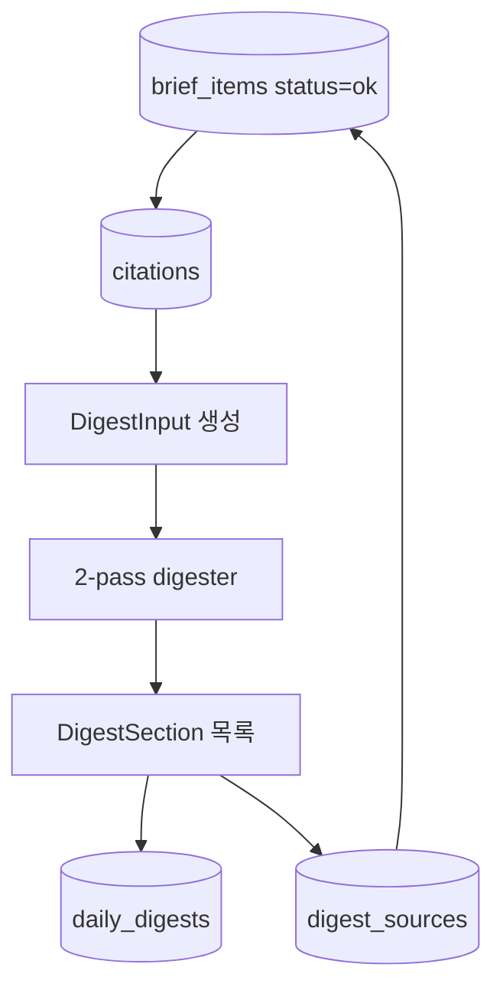
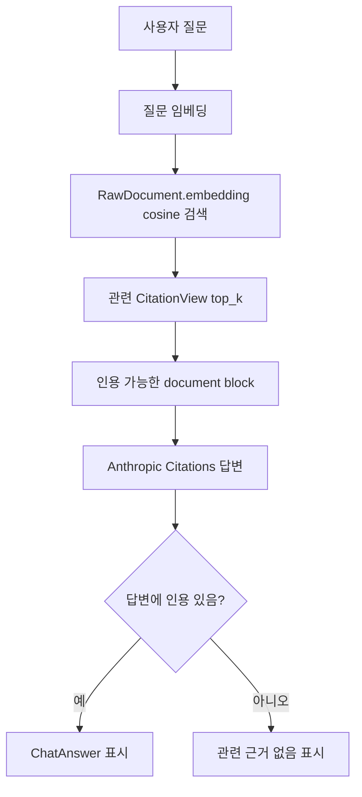
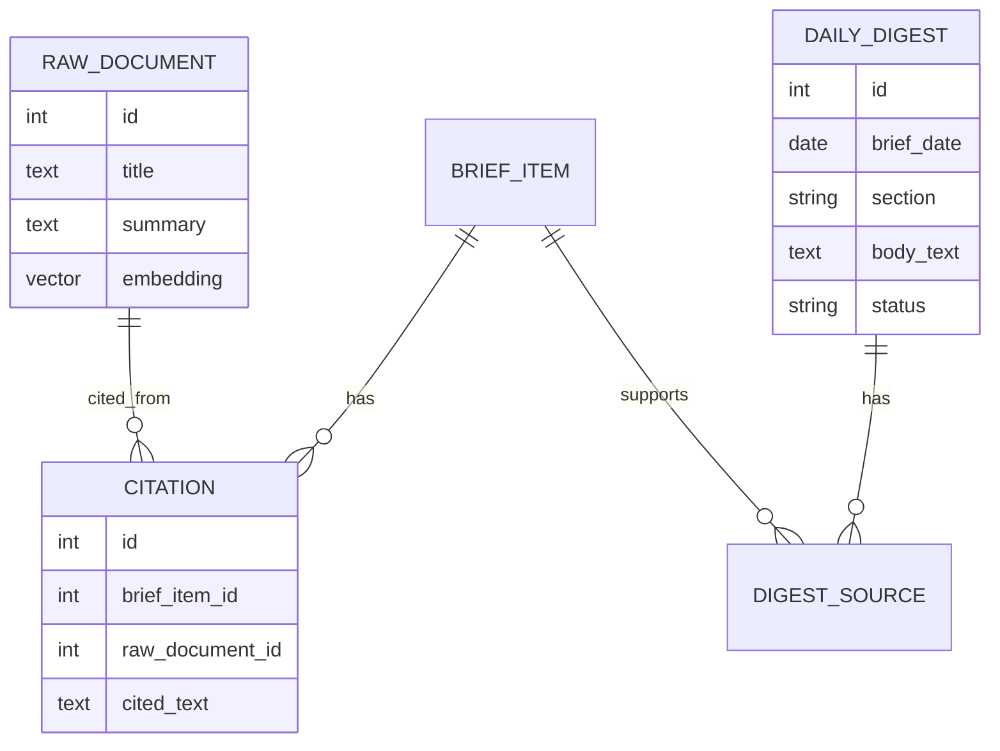

# 05. 다이제스트와 RAG

## 한 줄 요약

일일 다이제스트는 그날의 검증된 브리프 근거를 요약하고, 누적 RAG 채팅은 임베딩 검색으로 날짜를 넘나드는 과거 근거를 찾아 답변한다.

## 비개발자 설명

대시보드의 다이제스트는 단순한 자유 요약이 아니다. 그날 `status="ok"`로 저장된 브리프와 그 브리프의 인용 근거만 사용한다. 요약 문장도 근거를 추적할 수 있도록 `DigestSource`가 어떤 브리프에서 왔는지 연결한다.

채팅은 두 가지 모드가 있다.

- 날짜별 채팅: 현재 선택한 날짜의 브리프 근거만 사용한다.
- 전체 누적 채팅: 과거 전체 문서 중 질문과 가까운 근거를 임베딩으로 검색한 뒤 답한다.

## 설계도: 일일 다이제스트

### 다이어그램 코드 매핑

| 설계도 박스 | 담당 코드 |
| --- | --- |
| `brief_items status=ok` | `app.pipeline.digest::_ok_inputs` |
| `citations` | `app.models::Citation` |
| `DigestInput 생성` | `app.pipeline.digest::DigestInput`, `_ok_inputs` |
| `2-pass digester` | `app.pipeline.digest::anthropic_digester` |
| `DigestSection 목록` | `app.pipeline.digest::DigestSection` |
| `daily_digests` | `app.models::DailyDigest` |
| `digest_sources` | `app.models::DigestSource` |

## 설계도: 누적 RAG 채팅

### 다이어그램 코드 매핑

| 설계도 박스 | 담당 코드 |
| --- | --- |
| `사용자 질문` | `app/main.py::chat` |
| `질문 임베딩` | `app.web.chat::anthropic_rag_chat`, `app.embed::Embedder` |
| `RawDocument.embedding cosine 검색` | `app.web.queries::search_citation_spans` |
| `CitationView top_k` | `app.web.queries::CitationView` |
| `인용 가능한 document block` | `app.web.chat::_chat_documents` |
| `Anthropic Citations 답변` | `app.web.chat::anthropic_rag_chat` |
| `ChatAnswer 표시` | `app.web.templates::_chat_answer.html` |

## 코드/폴더 매핑

| 코드 | 역할 |
| --- | --- |
| [`app/pipeline/digest.py`](../../app/pipeline/digest.py) | 일일 다이제스트 생성과 저장 |
| [`app/embed/__init__.py`](../../app/embed/__init__.py) | 임베더 인터페이스, 실제 임베더 선택, 테스트용 FakeEmbedder |
| [`app/pipeline/embed.py`](../../app/pipeline/embed.py) | `RawDocument.embedding`을 채우는 배치 작업 |
| [`app/web/chat.py`](../../app/web/chat.py) | 날짜별 채팅과 누적 RAG 채팅 분석기 |
| [`app/web/queries.py`](../../app/web/queries.py) | 다이제스트 조회, 인용 span 벡터 검색 |
| [`app/models.py`](../../app/models.py) | `DailyDigest`, `DigestSource`, `Citation`, `RawDocument.embedding` 정의 |

## 핵심 데이터 관계

| 데이터 | 업무 의미 |
| --- | --- |
| `DailyDigest` | 대시보드 상단에 보이는 일일 요약 섹션 |
| `DigestSource` | 이 요약이 어떤 `BriefItem` 근거에서 나왔는지 연결 |
| `Citation` | AI가 실제로 인용한 텍스트 조각 |
| `RawDocument.embedding` | 누적 RAG 검색에서 질문과 관련 문서를 찾는 벡터 |

## 왜 pgvector/embedding을 쓰는가

날짜별 채팅은 오늘 화면에 있는 근거만 사용한다. 그러나 사용자가 "최근 며칠 동안 비슷한 이슈가 있었나?"처럼 날짜를 넘는 질문을 하면, 단순 날짜 필터로는 답하기 어렵다.

`RawDocument.embedding`은 문서 제목과 요약을 벡터로 저장한다. 누적 RAG 채팅은 질문도 같은 방식으로 벡터화하고, pgvector의 cosine distance로 가까운 문서를 찾는다. 이렇게 찾은 문서에 연결된 `Citation`만 다시 AI에 넘기므로, 날짜를 넘나들어도 답변 근거는 DB에 저장된 인용 범위 안에 머문다.

## 관련 테스트

| 테스트 파일 | 막는 사고 |
| --- | --- |
| [`tests/test_digest.py`](../../tests/test_digest.py) | 다이제스트가 근거 없이 생성되거나 재실행 시 중복되는 사고 |
| [`tests/test_digest_view.py`](../../tests/test_digest_view.py) | 화면 조회용 다이제스트 정렬과 소스 매핑 오류 |
| [`tests/test_embed.py`](../../tests/test_embed.py) | 임베딩 저장 누락과 중복 저장 사고 |
| [`tests/test_rag_chat.py`](../../tests/test_rag_chat.py) | 누적 검색이 날짜를 넘어 근거를 찾고, 인용 없이는 답하지 않는지 |
| [`tests/test_integration_stage15.py`](../../tests/test_integration_stage15.py) | 일일 실행 결과가 검색 가능한 코퍼스로 이어지는지 |

## 다음에 읽을 문서

1. [06. 대시보드와 채팅 UI](./06-dashboard-and-chat-ui.md)
2. [07. 데이터 모델](./07-data-model.md)
