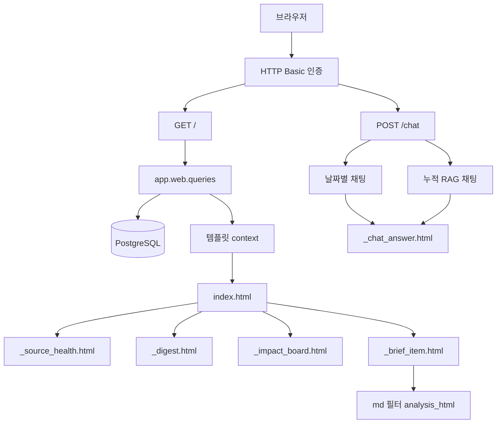
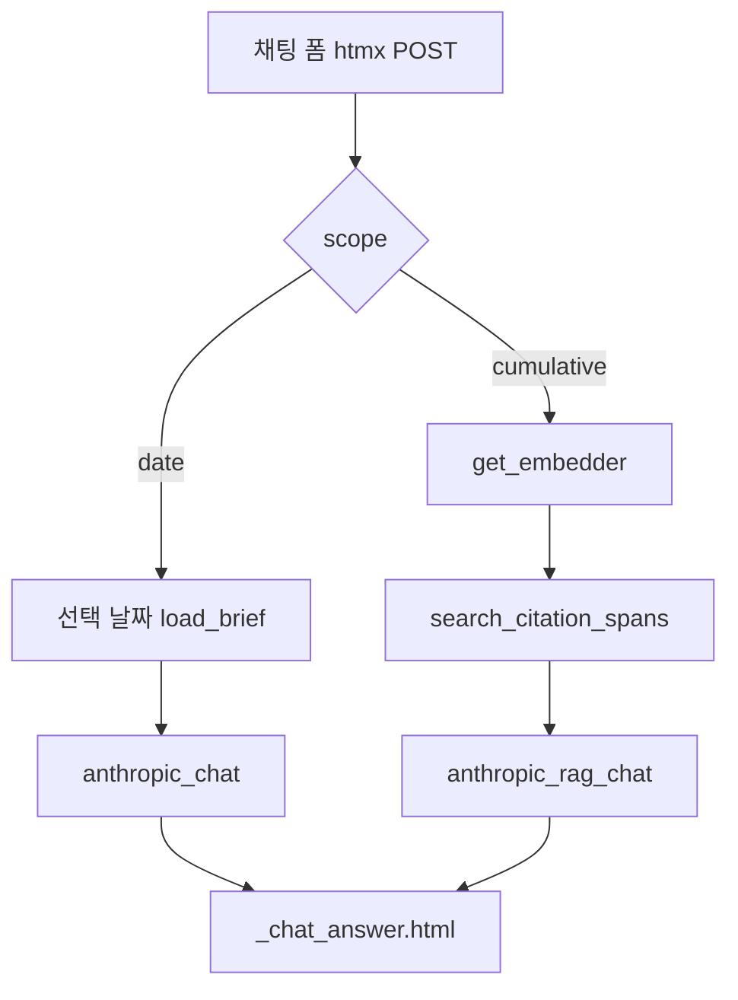

# 06. 대시보드와 채팅 UI

## 한 줄 요약

대시보드는 DB에 저장된 실행 상태, 다이제스트, 임팩트 보드, 브리프, 인용 근거를 날짜별로 보여주고, 채팅은 선택 날짜 또는 누적 코퍼스의 인용 근거 안에서만 답한다.

## 비개발자 설명

화면은 새 분석을 즉석에서 만들기보다, 이미 DB에 저장된 결과를 읽어서 보여준다. 사용자가 날짜 칩을 누르면 해당 날짜의 브리프, 다이제스트, 소스 상태를 다시 조회하고, 자산 탭(전체/주식/암호화폐)으로 화면 안에서 필터링한다. 임팩트 보드의 카드를 누르면 그 자리에서 근거 브리프가 인라인 드로어로 펼쳐진다.

채팅만 별도의 POST 요청으로 동작하며, 이때도 모델이 마음대로 답하는 게 아니라 화면에 표시된 인용 근거("이 날짜") 또는 누적 검색으로 찾은 인용 근거("전체 누적")만 사용한다. 모델이 근거를 하나도 인용하지 못하면 답 대신 "관련 근거 없음"을 보여준다. 모든 화면과 채팅은 HTTP Basic 인증 뒤에 있다.

## 설계도

### 다이어그램 코드 매핑

| 설계도 박스 | 담당 코드 |
| --- | --- |
| HTTP Basic 인증 | `app/main.py::_require_dashboard_auth` |
| `GET /` | `app/main.py::dashboard` |
| `POST /chat` | `app/main.py::chat` |
| `app.web.queries` | [`app/web/queries.py`](../../app/web/queries.py) |
| md 필터 analysis_html | `app/web/render.py::analysis_html` |
| `index.html` | [`app/web/templates/index.html`](../../app/web/templates/index.html) |
| `_source_health.html` | [`app/web/templates/_source_health.html`](../../app/web/templates/_source_health.html) |
| `_digest.html` | [`app/web/templates/_digest.html`](../../app/web/templates/_digest.html) |
| `_impact_board.html` | [`app/web/templates/_impact_board.html`](../../app/web/templates/_impact_board.html) |
| `_brief_item.html` | [`app/web/templates/_brief_item.html`](../../app/web/templates/_brief_item.html) |
| `_chat_answer.html` | [`app/web/templates/_chat_answer.html`](../../app/web/templates/_chat_answer.html) |
| 날짜별 채팅 | `app/web/chat.py::anthropic_chat` |
| 누적 RAG 채팅 | `app/web/chat.py::anthropic_rag_chat` |

## 화면 영역과 DB 결과 매핑

| 화면 영역 | 사용자가 보는 정보 | 조회 코드 | 주요 DB |
| --- | --- | --- | --- |
| 날짜 칩 | 최근 14일 날짜 목록, 데이터가 있는 날짜 표시 | `dates_with_briefs` | `brief_items.brief_date` |
| 소스 상태 | 수집기별 성공/실패, 다이제스트 상태, 실행 시각 | `load_source_health` | `audit_log.payload` |
| 일일 다이제스트 | 거시/섹터별 요약과 근거 브리프 링크 | `load_digest` | `daily_digests`, `digest_sources` |
| 자산 탭 | 전체/주식/암호화폐 필터와 탭별 건수 | `BriefView.asset_classes`, `board_asset_counts` | `brief_item_tickers.market` |
| 임팩트 보드 | 영향 점수 내림차순 이벤트 카드(그룹=클러스터) | `rank_board` | `brief_items.impact_score`, `brief_items.cluster_id`, `brief_item_tickers` |
| 브리프 카드 | 이벤트 유형, 방향, 신뢰도, 분석문, 종목, 인용 근거 | `load_brief` | `brief_items`, `brief_item_tickers`, `citations`, `raw_documents` |
| 근거 기반 질문 | 날짜별 또는 누적 근거 기반 답변 | `anthropic_chat`, `anthropic_rag_chat` | `citations`, `raw_documents.embedding` |

## 코드/폴더 매핑

| 코드 | 역할 |
| --- | --- |
| [`app/main.py`](../../app/main.py) | 화면 라우팅, Basic 인증, 날짜 파싱(KST), 템플릿 context 조립 |
| `app.main::dashboard` | 선택 날짜의 브리프, 다이제스트, 소스 상태, 날짜 칩, 자산 카운트 조회 |
| `app.main::chat` | scope 폼 값으로 날짜별 채팅과 누적 RAG 채팅 분기 |
| [`app/web/queries.py`](../../app/web/queries.py) | 화면 표시용 읽기 모델 `BriefView`, `BoardRow`, `DigestView`, `SourceHealthView` 생성과 누적 검색 `search_citation_spans` |
| [`app/web/chat.py`](../../app/web/chat.py) | Citations API 채팅 분석과 인용 매핑(`_parse_chat`) |
| [`app/web/render.py`](../../app/web/render.py) | LLM 분석 마크다운을 XSS 안전 HTML로 바꾸는 `md` Jinja 필터 |
| [`app/web/templates/`](../../app/web/templates) | Jinja2 HTML 조각 + 인라인 드로어/자산 탭/테마 토글 스크립트 |
| [`app/web/static/app.css`](../../app/web/static/app.css) | 토큰 기반 디자인 시스템(다크 기본 + 라이트 토글, data-* 의미 인코딩) |

## 채팅 흐름

날짜별 채팅은 현재 화면 날짜의 `BriefView.citations`(cited_text)만 citable document 블록으로 먹인다. 누적 채팅은 질문 임베딩으로 전 날짜 citation 코퍼스를 코사인 유사도 검색(`search_citation_spans`, top 8)해 먹인다 — 검색은 무엇을 먹일지만 바꾸고 신뢰 경계는 동일하다. 두 경로 모두 거부 판정은 인용 유무가 유일 기준이다: 모델 응답에 citation이 0건이면 LLM 텍스트와 무관하게 "관련 근거 없음"으로 처리한다. 키가 없으면 "채팅 비활성"이 뜨고, 누적 경로는 임베더까지 없으면 첫 질의에서 graceful하게 비활성으로 떨어진다.

## 왜 이렇게 만들었나

화면은 분석 파이프라인과 분리되어 있다. 화면 요청마다 수집이나 분석을 다시 하지 않기 때문에 사용자는 저장된 결과를 빠르게 볼 수 있고, 운영자는 DB 상태를 기준으로 문제를 추적할 수 있다. 화면용 쿼리는 `app/web/queries.py`에 모아 순수 SELECT만 둔다 — 템플릿이 SQL을 알 필요가 없고, 테스트도 읽기 모델 기준으로 작성한다.

날짜는 전부 KST로 앵커한다. `brief_date`가 KST 기준일(06:40 KST 크론과 동일)이라, `_parse_date`의 기본값과 `/trigger`의 기준일도 `datetime.now(_KST).date()`를 쓴다. 날짜 경계를 UTC로 잡으면 KST 오전 실행분이 통째로 다른 날짜로 밀리는 사고(빈 다이제스트)가 실측으로 있었다.

`rag_enabled`는 API 키 유무만 본다 — 대시보드 렌더에서 `get_embedder()`를 부르지 않는다. 2GB bge-m3 모델이 페이지 요청에 로드되면 안 되기 때문에, 임베더는 첫 누적 질의에서 지연 로드한다(이후 `lru_cache`). 또 sentence-transformers는 로컬 캐시가 있어도 로드 시 HF 허브로 HEAD 요청을 보내 사내 TLS 가로채기 환경에서 500을 내므로, 서버는 `HF_HUB_OFFLINE=1`로 띄운다. Anthropic 클라이언트는 `citations.build_client`를 재사용해 truststore로 OS 인증서를 신뢰시킨다.

LLM 출력은 신뢰하지 않는다. 분석문은 `analysis_html`이 escape 후 마크다운 변환하므로 LLM발 HTML 태그가 살아남지 않고(XSS 차단), `load_brief`는 같은 (문서, 인용문) 중복 인용을 한 번만 담는다 — LLM이 같은 인용을 여러 번 출력해 적재된 행(실측 citations의 41%)이 화면에 3~4회 반복 표시되던 /qa 발견 이슈의 렌더 측 차단이다.

임팩트 보드의 점수는 이벤트(brief_item) 단위다 — 티커별 점수는 데이터에 없으므로 만들지 않는다(zero-fabrication). 클러스터 그룹은 색+모양+문자(G1 ●)로 3중 인코딩해 색맹도 구분할 수 있다. 화면의 종목 표시는 투자 권유가 아니라 뉴스·공시 근거 기반 영향도 분석이며, 보드 하단 범례에도 이를 명시한다.

## 관련 테스트

| 테스트 파일 | 막는 사고 |
| --- | --- |
| [`tests/test_web.py`](../../tests/test_web.py) | 브리프 그룹핑, 인용 링크, 날짜 칩, 채팅 인용 파싱·거부 로직 오류 |
| [`tests/test_qa_regressions.py`](../../tests/test_qa_regressions.py) | 마크다운 raw 노출·XSS, 인용 중복 표시 재발(/qa 발견 이슈 회귀) |
| [`tests/test_digest_view.py`](../../tests/test_digest_view.py) | 다이제스트 카드와 소스 헬스 패널 표시 오류 |
| [`tests/test_rag_chat.py`](../../tests/test_rag_chat.py) | 누적 검색 정렬·임베딩 NULL 제외·scope 분기와 비활성 처리 오류 |
| [`tests/test_health.py`](../../tests/test_health.py) | health endpoint와 /trigger 동시성 응답(409) 오류 |

## 다음에 읽을 문서

1. [07. 데이터 모델](07-data-model.md)
