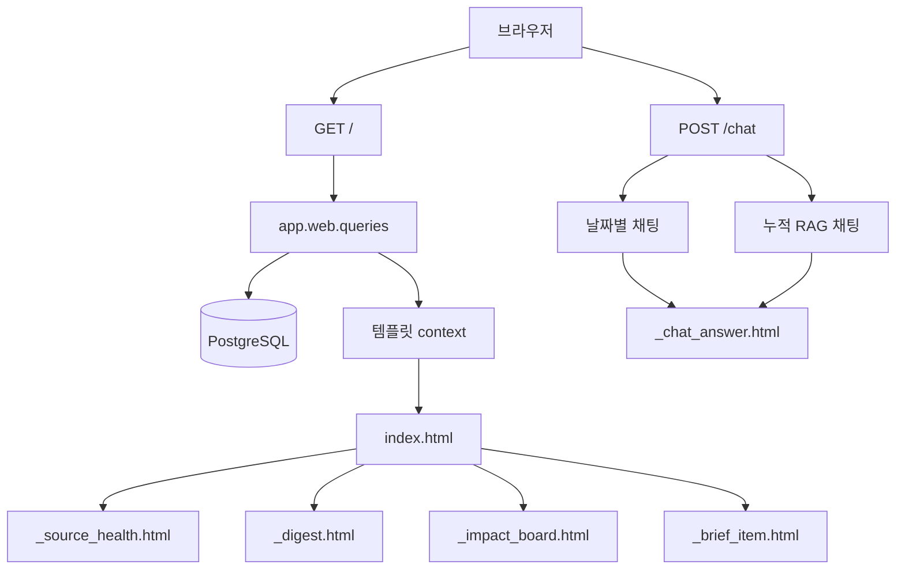
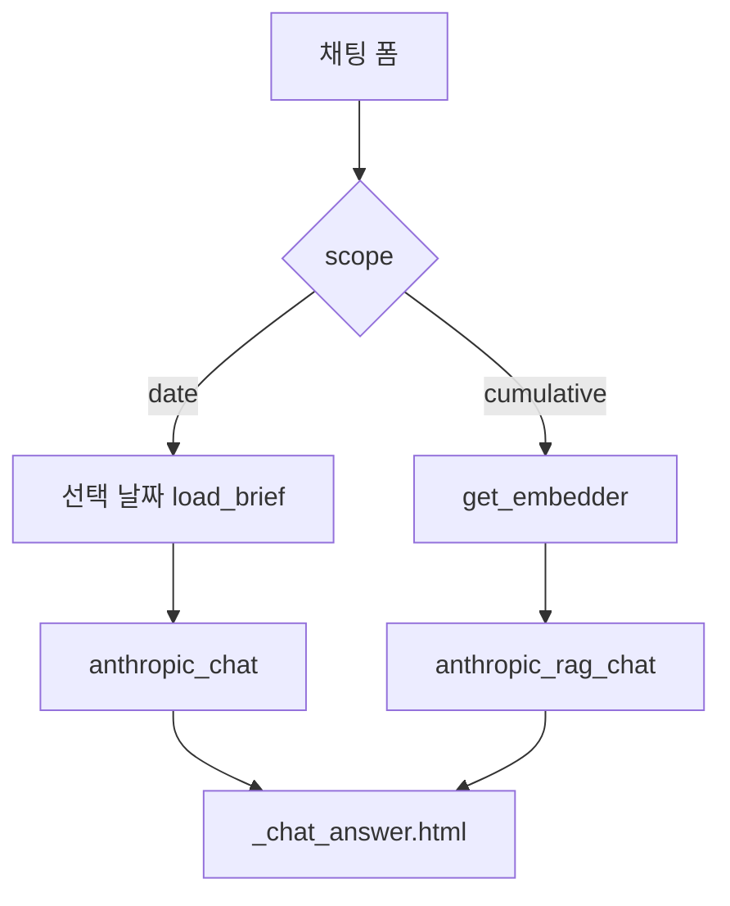

# 06. 대시보드와 채팅 UI

## 한 줄 요약

대시보드는 DB에 저장된 실행 상태, 다이제스트, 브리프, 인용 근거를 날짜별로 보여주고, 채팅은 선택 날짜 또는 누적 코퍼스의 근거 안에서만 답한다.

## 비개발자 설명

화면은 새 분석을 즉석에서 만들기보다, 이미 DB에 저장된 결과를 읽어서 보여준다. 사용자가 날짜를 바꾸면 해당 날짜의 브리프, 다이제스트, 실행 상태를 다시 조회한다. 채팅만 별도의 POST 요청으로 동작하며, 이때도 화면에 표시된 근거 또는 누적 검색으로 찾은 근거를 사용한다.

## 설계도

### 다이어그램 코드 매핑

| 설계도 박스 | 담당 코드 |
| --- | --- |
| `GET /` | `app/main.py::dashboard` |
| `POST /chat` | `app/main.py::chat` |
| `app.web.queries` | [`app/web/queries.py`](../../app/web/queries.py) |
| `index.html` | [`app/web/templates/index.html`](../../app/web/templates/index.html) |
| `_source_health.html` | [`app/web/templates/_source_health.html`](../../app/web/templates/_source_health.html) |
| `_digest.html` | [`app/web/templates/_digest.html`](../../app/web/templates/_digest.html) |
| `_impact_board.html` | [`app/web/templates/_impact_board.html`](../../app/web/templates/_impact_board.html) |
| `_brief_item.html` | [`app/web/templates/_brief_item.html`](../../app/web/templates/_brief_item.html) |
| `_chat_answer.html` | [`app/web/templates/_chat_answer.html`](../../app/web/templates/_chat_answer.html) |

## 화면 영역과 DB 결과 매핑

| 화면 영역 | 사용자가 보는 정보 | 조회 코드 | 주요 DB |
| --- | --- | --- | --- |
| 날짜 칩 | 최근 날짜 목록, 데이터가 있는 날짜 표시 | `dates_with_briefs` | `brief_items.brief_date` |
| 소스 상태 | 수집기별 성공/실패, 다이제스트 상태, 실행 시각 | `load_source_health` | `audit_log.payload` |
| 일일 다이제스트 | 거시/섹터별 요약과 근거 브리프 링크 | `load_digest` | `daily_digests`, `digest_sources` |
| 자산 필터 | 전체/주식/가상자산 필터 | `BriefView.asset_classes`, `BoardRow.asset_classes` | `brief_item_tickers.market` |
| 임팩트 보드 | 영향 점수 높은 이벤트 카드 | `rank_board` | `brief_items.impact_score`, `brief_item_tickers` |
| 브리프 카드 | 이벤트 유형, 방향, 신뢰도, 분석문, 종목, 인용 근거 | `load_brief` | `brief_items`, `brief_item_tickers`, `citations`, `raw_documents` |
| 근거 기반 질문 | 날짜별 또는 누적 근거 기반 답변 | `anthropic_chat`, `anthropic_rag_chat` | `citations`, `raw_documents.embedding` |

## 코드/폴더 매핑

| 코드 | 역할 |
| --- | --- |
| [`app/main.py`](../../app/main.py) | 화면 라우팅, 날짜 파싱, 템플릿 context 조립 |
| `app.main::dashboard` | 선택 날짜의 브리프, 다이제스트, 소스 상태, 날짜 칩 조회 |
| `app.main::chat` | 날짜별 채팅과 누적 RAG 채팅 분기 |
| [`app/web/queries.py`](../../app/web/queries.py) | 화면 표시용 읽기 모델인 `BriefView`, `DigestView`, `SourceHealthView`, `BoardRow` 생성 |
| [`app/web/chat.py`](../../app/web/chat.py) | 채팅 분석과 인용 매핑 |
| [`app/web/templates/`](../../app/web/templates) | Jinja2 HTML 조각 |
| [`app/web/static/app.css`](../../app/web/static/app.css) | 화면 스타일 |

## 채팅 흐름

날짜별 채팅은 현재 화면 날짜의 `BriefView.citations`만 사용한다. 누적 채팅은 질문 임베딩으로 과거 전체 코퍼스의 관련 citation을 찾아 사용한다. 두 경로 모두 모델 응답에 citation이 없으면 "관련 근거 없음"으로 처리한다.

## 왜 이렇게 만들었나

화면은 분석 파이프라인과 분리되어 있다. 화면 요청마다 수집이나 분석을 다시 하지 않기 때문에 사용자는 저장된 결과를 빠르게 볼 수 있고, 운영자는 DB 상태를 기준으로 문제를 추적할 수 있다.

또한 화면용 쿼리를 `app/web/queries.py`에 모아 두었다. 템플릿이 복잡한 SQL을 직접 알 필요가 없고, 테스트도 화면 표시용 데이터 구조를 기준으로 작성할 수 있다.

## 관련 테스트

| 테스트 파일 | 막는 사고 |
| --- | --- |
| [`tests/test_web.py`](../../tests/test_web.py) | 브리프, 인용 링크, 날짜 칩, 채팅 응답 렌더링 오류 |
| [`tests/test_digest_view.py`](../../tests/test_digest_view.py) | 다이제스트 카드와 소스 상태 표시 오류 |
| [`tests/test_rag_chat.py`](../../tests/test_rag_chat.py) | 누적 채팅 scope 분기와 비활성 처리 오류 |
| [`tests/test_health.py`](../../tests/test_health.py) | 기본 대시보드와 health endpoint 동작 |

## 다음에 읽을 문서

1. [07. 데이터 모델](./07-data-model.md)
2. [08. 테스트와 품질 게이트](./08-tests-and-quality-gates.md)
