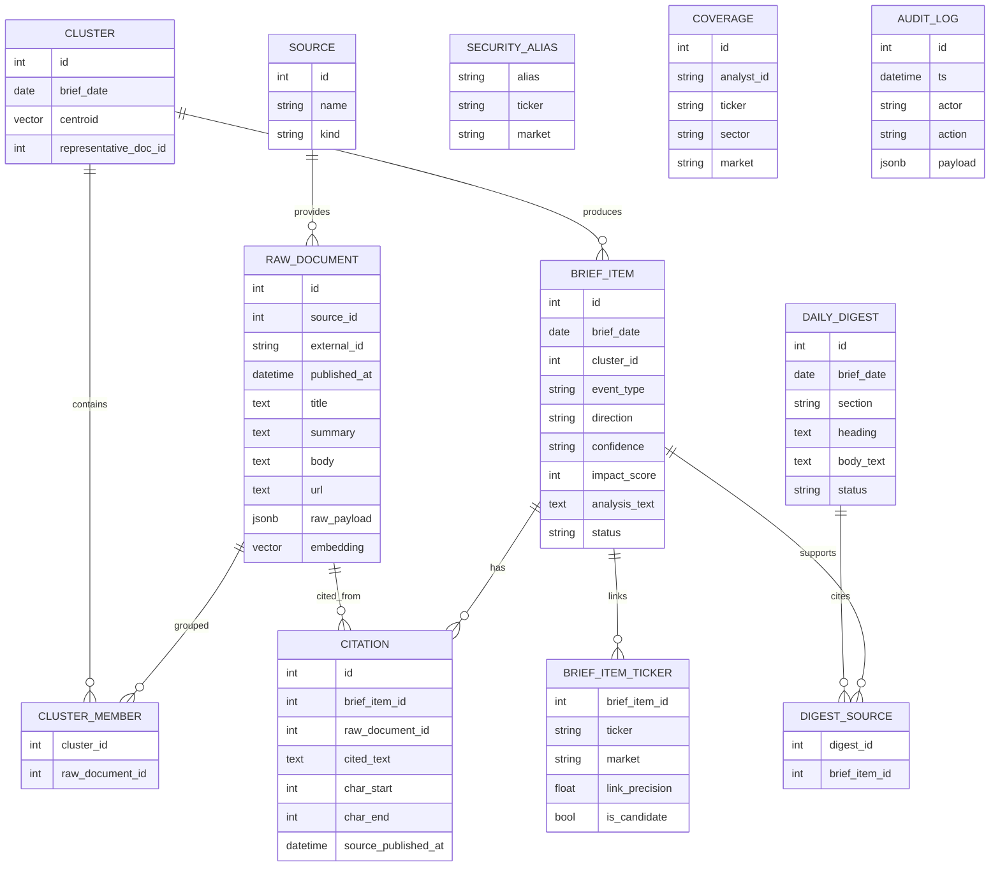

# 07. 데이터 모델

## 한 줄 요약

DB는 원문 수집, 사건 묶음, 브리프 분석, 인용 근거, 종목 연결, 다이제스트, 실행 로그를 각각 별도 테이블로 보관한다.

## 비개발자 설명

이 프로젝트의 DB는 단순 저장소가 아니라 감사 가능한 작업 기록이다. 어떤 문서를 어디서 가져왔는지, 어떤 문서들이 하나의 사건으로 묶였는지, AI가 어떤 문장을 근거로 분석했는지, 화면의 다이제스트가 어떤 브리프에서 나왔는지를 모두 테이블 관계로 남긴다.

스키마 변경은 alembic 마이그레이션(현재 0001~0004)으로만 이루어지며, 테스트 DB도 같은 마이그레이션을 그대로 적용해 만든다. 즉 개발·테스트·운영이 전부 같은 스키마 이력을 공유한다.

## 설계도

`SECURITY_ALIAS`, `COVERAGE`, `AUDIT_LOG`는 FK 없이 독립적으로 쓰이는 참조/기록 테이블이라 관계선이 없다.

### 다이어그램 코드 매핑

| ERD 엔티티 | 담당 코드 |
| --- | --- |
| `SOURCE` | `app/models.py::Source` |
| `RAW_DOCUMENT` | `app/models.py::RawDocument` |
| `CLUSTER` | `app/models.py::Cluster` |
| `CLUSTER_MEMBER` | `app/models.py::ClusterMember` |
| `BRIEF_ITEM` | `app/models.py::BriefItem` |
| `BRIEF_ITEM_TICKER` | `app/models.py::BriefItemTicker` |
| `CITATION` | `app/models.py::Citation` |
| `DAILY_DIGEST` | `app/models.py::DailyDigest` |
| `DIGEST_SOURCE` | `app/models.py::DigestSource` |
| `SECURITY_ALIAS` | `app/models.py::SecurityAlias` |
| `COVERAGE` | `app/models.py::Coverage` |
| `AUDIT_LOG` | `app/models.py::AuditLog` |

## 코드/폴더 매핑

| 코드 | 역할 |
| --- | --- |
| [`app/models.py`](../../app/models.py) | SQLAlchemy ORM 모델 정의(테이블 12개 전부) |
| [`app/db.py`](../../app/db.py) | 엔진·`SessionLocal`(`autoflush=False`) 구성 |
| [`alembic.ini`](../../alembic.ini) | alembic 설정(ASCII만 — URL은 여기 두지 않음) |
| [`migrations/env.py`](../../migrations/env.py) | `settings.database_url`을 `create_engine`에 직접 전달 |
| [`migrations/versions/0001_initial.py`](../../migrations/versions/0001_initial.py) | vector 확장 + 초기 9개 테이블 생성 |
| [`migrations/versions/0002_security_aliases.py`](../../migrations/versions/0002_security_aliases.py) | `security_aliases` 추가 |
| [`migrations/versions/0003_stage15_digest_embedding.py`](../../migrations/versions/0003_stage15_digest_embedding.py) | `daily_digests`, `digest_sources`, vector(1024) 고정, HNSW 인덱스 |
| [`migrations/versions/0004_brief_item_impact_score.py`](../../migrations/versions/0004_brief_item_impact_score.py) | `brief_items.impact_score` 추가 |
| [`tests/conftest.py`](../../tests/conftest.py) | 테스트 DB에 alembic `upgrade head` 적용 + 테이블 TRUNCATE 격리 |

## 주요 테이블 설명

| 테이블 | 업무 개념 | 주로 쓰는 코드 |
| --- | --- | --- |
| `sources` | 데이터를 가져온 출처(kind: news/filing) | 각 수집기 `upsert` (`app/collector/*.py`) |
| `raw_documents` | 수집된 뉴스/공시 원문과 메타데이터, RAG용 `embedding` | 수집기, 파이프라인, RAG 검색 |
| `clusters` | 같은 사건으로 볼 문서 묶음(`centroid`, 대표 문서) | `dedup`, `cluster` |
| `cluster_members` | 클러스터와 원문 문서의 연결 | `dedup`, `cluster`, `_cluster_source_docs` |
| `brief_items` | 화면에 표시되는 개별 영향 분석 항목(`impact_score` 포함) | `generate_impact`, `analyze_impact`, `load_brief` |
| `brief_item_tickers` | 브리프와 종목/시장 연결 | `ticker_link`, `rank_board` |
| `citations` | 분석의 실제 인용 근거(원문 조각 + 문자 오프셋) | `analyze_impact`, `load_brief`, RAG 채팅 |
| `daily_digests` | 일일 요약 섹션(`(brief_date, section)` 유니크, upsert 멱등) | `build_digest`, `load_digest` |
| `digest_sources` | 다이제스트가 참조한 브리프 ID | `build_digest`, `load_digest` |
| `audit_log` | 수집(`source_fetch`), 시딩(`seed`), 일일 실행(`daily_run`) 기록 | `_collect`, `run_daily`, `load_source_health` |
| `security_aliases` | 회사명/별칭 → (ticker, market) 사전 | `load_aliases`, `ticker_link`, opendart/sec/coingecko 동기화 |
| `coverage` | 커버리지 유니버스(분석 대상 종목/섹터) | `seed_universe`, 네이버 수집 검색어 도출 |

## 상태값의 의미

| 필드 | 값 | 의미 |
| --- | --- | --- |
| `BriefItem.status` | `empty` | 근거가 없거나 아직 분석 결과가 없음 |
| `BriefItem.status` | `degraded` | 분석기/API 오류 등으로 정상 분석하지 못함 |
| `BriefItem.status` | `ok` | 인용 근거가 있고 분석 결과가 저장됨(이때만 `impact_score`가 채워짐) |
| `DailyDigest.status` | `empty` | 그날 다이제스트로 만들 근거가 없음 |
| `DailyDigest.status` | `degraded` | 다이제스트 생성기를 사용할 수 없거나 실패 |
| `DailyDigest.status` | `ok` | 근거 기반 다이제스트가 저장됨 |

## 왜 이렇게 만들었나

분석 결과와 근거를 같은 텍스트 필드에 섞어 두면 나중에 검증하기 어렵다. 이 모델은 결과와 근거를 분리한다. `BriefItem`은 해석 결과이고, `Citation`은 그 해석을 지탱하는 원문 조각이다. `DailyDigest`도 본문과 출처 브리프를 `DigestSource`로 분리한다. 종목 연결(`BriefItemTicker`)도 "투자 권유"가 아니라 뉴스/공시 근거에서 도출된 영향도 표기이므로, 어느 브리프에서 나왔는지가 항상 FK로 남는다.

임베딩 차원은 0001에서는 미고정(`Vector()`)이었다가 0003에서 vector(1024)로 고정했다(bge-m3/e5-large 권장군, `config.embedding_dim`과 일치 필수). 날짜별 브리프 조회와 달리 누적 RAG 검색은 여러 날짜의 과거 문서를 훑으므로 `raw_documents.embedding`에 HNSW cosine 인덱스를 별도로 둔다.

운영 중 실측으로 굳어진 규칙들이 이 레이어에 몰려 있다:

- **alembic.ini에는 ASCII만**: configparser가 읽는 설정 파일에 한글 주석을 넣으면 Windows cp949 로케일로 읽혀 `UnicodeDecodeError`로 alembic 자체가 로드 실패한다. 비-ASCII 주석은 `.py`(UTF-8)에만 둔다.
- **DB URL은 configparser를 거치지 않는다**: `migrations/env.py`가 URL을 `config.set_main_option`으로 왕복시키면 URL-인코딩된 비밀번호의 `%`를 보간 문법으로 오인해 `invalid interpolation syntax`로 죽는다. 그래서 `create_engine(settings.database_url, ...)`로 직접 넘긴다.
- **`ON CONFLICT DO NOTHING`의 rowcount는 -1**: `security_aliases` 동기화(opendart/sec/coingecko)에서 신규 적재 수를 세려면 `.returning(...)`으로 반환 행을 직접 센다. rowcount는 신뢰할 수 없다(3971건 적재에도 -1 실측).
- **`SessionLocal`은 `autoflush=False`**: 한 파이프라인 단계가 직전 단계가 `add`한 행을 SELECT로 다시 읽는 구조(dedup→cluster)에서는 쓴 단계 끝에 `session.flush()`를 명시 호출한다. 안 하면 후속 SELECT가 미반영 행을 못 봐 중복 클러스터가 생긴다(실측 회귀). 커밋은 호출자가 일괄 처리한다.
- **마이그레이션 검증은 실DB 라운드트립**: pytest(conftest)는 `upgrade head`까지만 실행하므로, `alembic check`(모델-마이그레이션 드리프트)와 `downgrade` 결함은 테스트·CI를 통과한다. 변경 시 Docker `ankane/pgvector`에서 `upgrade head → alembic check(클린) → downgrade base`로 별도 검증한다.

## 관련 테스트

| 테스트 파일 | 막는 사고 |
| --- | --- |
| [`tests/conftest.py`](../../tests/conftest.py) | 테스트 DB 스키마(alembic head)와 세션 구성 오류 |
| [`tests/test_pipeline.py`](../../tests/test_pipeline.py) | 클러스터, 브리프, 인용 관계 저장 오류 |
| [`tests/test_digest.py`](../../tests/test_digest.py) | 다이제스트와 근거 브리프 연결 오류 |
| [`tests/test_web.py`](../../tests/test_web.py) | 화면용 조회 모델이 관계 데이터를 잘못 묶는 오류 |
| [`tests/test_rag_chat.py`](../../tests/test_rag_chat.py) | `RawDocument.embedding` 기반 검색 관계 오류 |
| [`tests/test_seed.py`](../../tests/test_seed.py) | `coverage` 유니버스 시딩 오류(중복 시딩 등) |
| [`tests/test_ticker_link.py`](../../tests/test_ticker_link.py) | `security_aliases` 사전 기반 종목 링크 오류 |

## 다음에 읽을 문서

1. [08. 테스트와 품질 게이트](./08-tests-and-quality-gates.md)
2. [00. 시스템 전체 개요](./00-system-overview.md)
