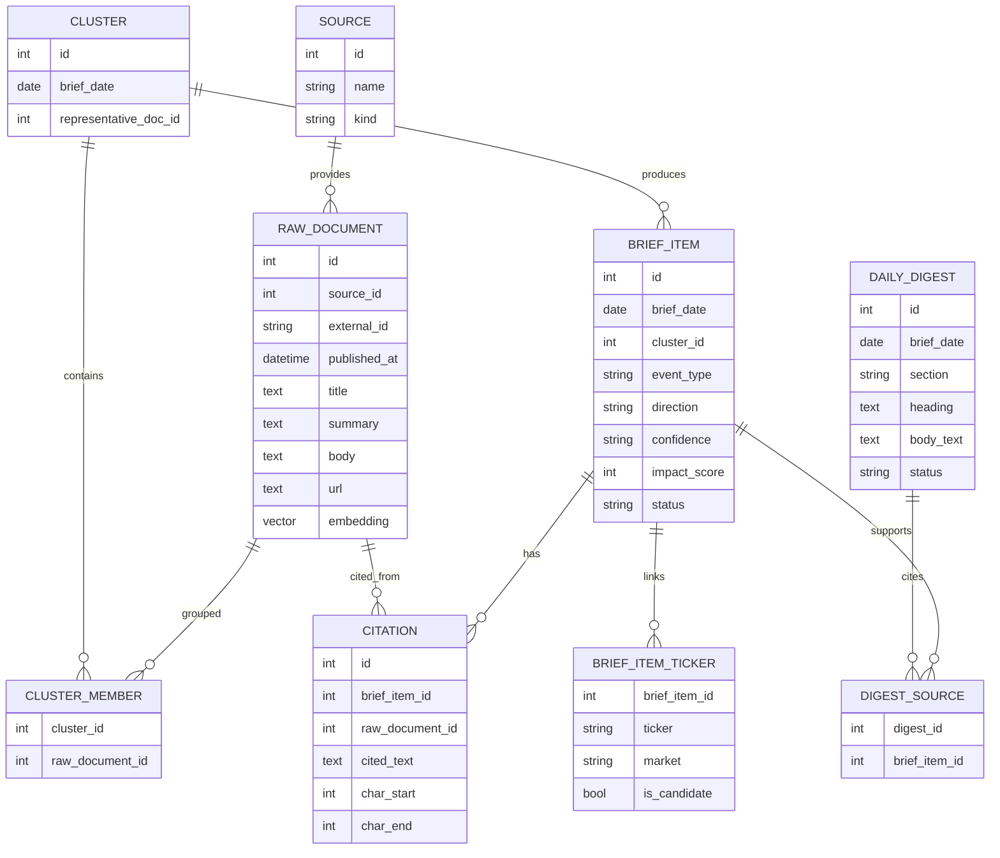

# 07. 데이터 모델

## 한 줄 요약

DB는 원문 수집, 사건 묶음, 브리프 분석, 인용 근거, 종목 연결, 다이제스트, 실행 로그를 각각 별도 테이블로 보관한다.

## 비개발자 설명

이 프로젝트의 DB는 단순 저장소가 아니라 감사 가능한 작업 기록이다. 어떤 문서를 어디서 가져왔는지, 어떤 문서들이 하나의 사건으로 묶였는지, AI가 어떤 문장을 근거로 분석했는지, 화면의 다이제스트가 어떤 브리프에서 나왔는지를 모두 테이블 관계로 남긴다.

## 설계도

### 다이어그램 코드 매핑

| ERD 엔티티 | 담당 코드 |
| --- | --- |
| `SOURCE` | `app.models::Source` |
| `RAW_DOCUMENT` | `app.models::RawDocument` |
| `CLUSTER` | `app.models::Cluster` |
| `CLUSTER_MEMBER` | `app.models::ClusterMember` |
| `BRIEF_ITEM` | `app.models::BriefItem` |
| `BRIEF_ITEM_TICKER` | `app.models::BriefItemTicker` |
| `CITATION` | `app.models::Citation` |
| `DAILY_DIGEST` | `app.models::DailyDigest` |
| `DIGEST_SOURCE` | `app.models::DigestSource` |

## 코드/폴더 매핑

| 코드 | 역할 |
| --- | --- |
| [`app/models.py`](../../app/models.py) | SQLAlchemy ORM 모델 정의 |
| [`migrations/versions/0001_initial.py`](../../migrations/versions/0001_initial.py) | 초기 테이블 생성 |
| [`migrations/versions/0002_security_aliases.py`](../../migrations/versions/0002_security_aliases.py) | `security_aliases` 추가 |
| [`migrations/versions/0003_stage15_digest_embedding.py`](../../migrations/versions/0003_stage15_digest_embedding.py) | `daily_digests`, `digest_sources`, vector(1024), HNSW 인덱스 추가 |
| [`migrations/versions/0004_brief_item_impact_score.py`](../../migrations/versions/0004_brief_item_impact_score.py) | `brief_items.impact_score` 추가 |

## 주요 테이블 설명

| 테이블 | 업무 개념 | 주로 쓰는 코드 |
| --- | --- | --- |
| `sources` | 데이터를 가져온 출처 | 수집기 `upsert` |
| `raw_documents` | 수집된 뉴스/공시 원문과 메타데이터 | 수집기, 파이프라인, RAG 검색 |
| `clusters` | 같은 사건으로 볼 문서 묶음 | `dedup`, `cluster` |
| `cluster_members` | 클러스터와 원문 문서의 연결 | `dedup`, `cluster`, `_cluster_source_docs` |
| `brief_items` | 화면에 표시되는 개별 영향 분석 항목 | `generate_impact`, `analyze_impact`, `load_brief` |
| `brief_item_tickers` | 브리프와 종목/시장 연결 | `ticker_link`, `rank_board` |
| `citations` | 분석의 실제 인용 근거 | `analyze_impact`, `load_brief`, RAG 채팅 |
| `daily_digests` | 일일 요약 섹션 | `build_digest`, `load_digest` |
| `digest_sources` | 다이제스트가 참조한 브리프 ID | `build_digest`, `load_digest` |
| `audit_log` | 수집, 시딩, 일일 실행 기록 | `_collect`, `run_daily`, `load_source_health` |
| `security_aliases` | 회사명/별칭에서 ticker로 연결하는 사전 | `load_aliases`, `ticker_link` |
| `coverage` | 커버리지/유니버스 관련 보조 데이터 | `seed_universe` 관련 코드 |

## 상태값의 의미

| 필드 | 값 | 의미 |
| --- | --- | --- |
| `BriefItem.status` | `empty` | 근거가 없거나 아직 분석 결과가 없음 |
| `BriefItem.status` | `degraded` | 분석기/API 오류 등으로 정상 분석하지 못함 |
| `BriefItem.status` | `ok` | 인용 근거가 있고 분석 결과가 저장됨 |
| `DailyDigest.status` | `empty` | 그날 다이제스트로 만들 근거가 없음 |
| `DailyDigest.status` | `degraded` | 다이제스트 생성기를 사용할 수 없거나 실패 |
| `DailyDigest.status` | `ok` | 근거 기반 다이제스트가 저장됨 |

## 왜 이렇게 만들었나

분석 결과와 근거를 같은 텍스트 필드에 섞어 두면 나중에 검증하기 어렵다. 이 모델은 결과와 근거를 분리한다. `BriefItem`은 해석 결과이고, `Citation`은 그 해석을 지탱하는 원문 조각이다. `DailyDigest`도 본문과 출처 브리프를 `DigestSource`로 분리한다.

또한 원문 문서에는 `embedding`이 들어간다. 화면의 날짜별 조회와 달리 누적 RAG 검색은 여러 날짜의 과거 문서를 대상으로 하므로, 별도 vector 인덱스를 둔다.

## 관련 테스트

| 테스트 파일 | 막는 사고 |
| --- | --- |
| [`tests/conftest.py`](../../tests/conftest.py) | 테스트 DB 스키마와 세션 구성 오류 |
| [`tests/test_pipeline.py`](../../tests/test_pipeline.py) | 클러스터, 브리프, 인용 관계 저장 오류 |
| [`tests/test_digest.py`](../../tests/test_digest.py) | 다이제스트와 근거 브리프 연결 오류 |
| [`tests/test_web.py`](../../tests/test_web.py) | 화면용 조회 모델이 관계 데이터를 잘못 묶는 오류 |
| [`tests/test_rag_chat.py`](../../tests/test_rag_chat.py) | `RawDocument.embedding` 기반 검색 관계 오류 |

## 다음에 읽을 문서

1. [08. 테스트와 품질 게이트](./08-tests-and-quality-gates.md)
2. [00. 시스템 전체 개요](./00-system-overview.md)
