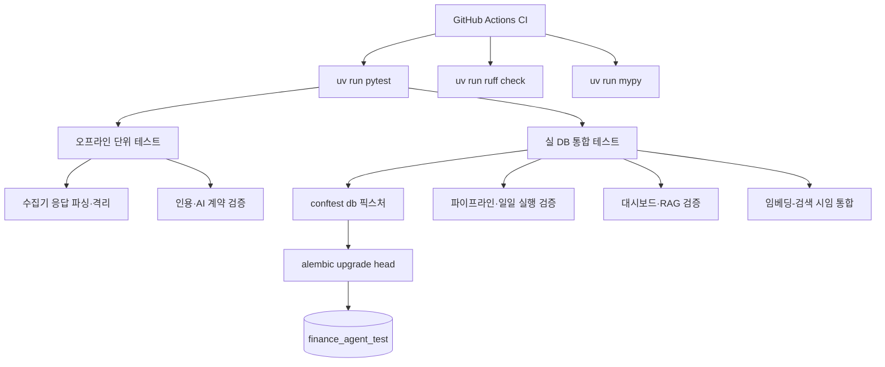

# 08. 테스트와 품질 게이트

## 한 줄 요약

테스트는 오프라인 단위 테스트와 실 Postgres(pgvector) 통합 테스트의 두 층으로 나뉘고, CI가 모든 push/PR에서 pytest·ruff·mypy를 강제해 수집 실패 전파, 근거 없는 AI 결과, 중복 실행, 화면-DB 불일치를 머지 전에 막는다.

## 비개발자 설명

이 프로젝트의 테스트는 단순히 코드가 실행되는지만 보는 것이 아니다. 운영 중 발생할 수 있는 사고를 막는 역할을 한다.

대표적으로 다음 사고를 막는다.

- 외부 API 하나가 실패해서 하루 전체 실행이 멈추는 사고
- AI가 인용 근거 없이 분석이나 답변을 저장하는 사고
- 같은 일일 실행이 동시에 두 번 돌아 중복 데이터가 생기는 사고
- 대시보드가 DB의 근거와 다른 내용을 보여주는 사고
- 누적 채팅이 관련 없는 과거 문서를 근거로 답하는 사고

테스트는 두 층으로 나뉜다. 첫 층은 네트워크·DB 없이 도는 오프라인 단위 테스트로, 외부 API 응답은 가짜 응답(MockTransport)으로, AI는 가짜 클라이언트로 흉내 낸다. 둘째 층은 실제 Postgres(pgvector)를 Docker로 띄워 alembic으로 스키마를 만든 뒤 도는 통합 테스트다. 실 DB가 없으면 통합 테스트는 자동으로 건너뛰므로 단위 테스트만으로도 빠르게 확인할 수 있다.

그리고 GitHub Actions CI가 코드를 올릴 때마다 이 전체(테스트 + 스타일 검사 + 타입 검사)를 자동으로 돌려, 사람이 깜빡해도 게이트가 잡아준다.

## 설계도

### 다이어그램 코드 매핑

| 설계도 박스 | 담당 코드 |
| --- | --- |
| `GitHub Actions CI` | [`.github/workflows/ci.yml`](../../.github/workflows/ci.yml) — pgvector 서비스 컨테이너 + pytest/ruff/mypy 3단계 |
| `conftest db 픽스처` | `tests/conftest.py::db` — 매 테스트 전 전 테이블 TRUNCATE로 격리 |
| `alembic upgrade head` | `tests/conftest.py::_migrated_db` — 실 DB 연결 프로브(2s 타임아웃) 후 스키마 마이그레이션, 연결 불가면 skip |
| `수집기 응답 파싱·격리` | `tests/test_rss.py`, `tests/test_naver.py`, `tests/test_opendart_docs.py`, `tests/test_edgar_docs.py`, `tests/test_marketaux.py`, `tests/test_finnhub.py` |
| `인용·AI 계약 검증` | `tests/test_citations.py`, `tests/test_swap.py`, `tests/test_ticker_link.py`, `tests/test_ticker_precision.py`, `tests/test_dedup.py`, `tests/test_freshness.py` |
| `파이프라인·일일 실행 검증` | `tests/test_pipeline.py`, `tests/test_runner.py`, `tests/test_seed.py` |
| `대시보드·RAG 검증` | `tests/test_web.py`, `tests/test_digest_view.py`, `tests/test_rag_chat.py`, `tests/test_health.py`, `tests/test_qa_regressions.py` |
| `임베딩-검색 시임 통합` | `tests/test_integration_stage15.py::test_embed_stage_output_is_retrievable_by_rag` |

## 코드/폴더 매핑

| 파일 | 검증하는 기능 | 막는 사고 |
| --- | --- | --- |
| [`tests/conftest.py`](../../tests/conftest.py) | 테스트 DB 하니스: DATABASE_URL을 `finance_agent_test`로 강제, alembic upgrade head, TRUNCATE 격리 | 개발 DB 오염, 테스트 간 상태 누수 |
| [`tests/test_runner.py`](../../tests/test_runner.py) | `run_daily` 소스 격리, audit_log, 빈 날 무크래시, `pg_try_advisory_lock` 동시성 가드 | 소스 하나 실패가 전체 실행을 중단하거나 중복 실행되는 사고 |
| [`tests/test_pipeline.py`](../../tests/test_pipeline.py) | `run_pipeline` dedup→cluster→brief_items 배선, 재실행 멱등 | 클러스터/브리프 중복 생성, 저장 순서 오류 |
| [`tests/test_freshness.py`](../../tests/test_freshness.py) | `_freshness_cutoff`의 KST 종일 앵커링 | UTC 자정 컷오프로 KST 오전 수집분이 통째로 잘리는 사고 |
| [`tests/test_citations.py`](../../tests/test_citations.py) | Citations 2-패스 `parse_pass1` index 매핑, Pass 2 입력 제한 | 원문과 인용 매핑이 뒤바뀌거나 근거 범위를 벗어나는 사고 |
| [`tests/test_swap.py`](../../tests/test_swap.py) | zero-fabrication: `cited_text`가 원문 `[char_start:char_end]` 슬라이스와 글자 단위 일치 | 인용 인덱스 오매핑(환각) |
| [`tests/test_digest.py`](../../tests/test_digest.py) | `build_digest` 빈 날·grounded·멱등·degraded | 근거 없는 다이제스트 생성, 재실행 중복 |
| [`tests/test_rag_chat.py`](../../tests/test_rag_chat.py) | `search_citation_spans` 코사인 정렬·NULL 제외·누적 검색, 인용 0건 거부 | 과거 근거 검색 실패 또는 인용 없는 답변 |
| [`tests/test_web.py`](../../tests/test_web.py) | `load_brief` 그룹핑, GET / HTML, POST /chat 근거있음 vs 거부 | 화면이 DB 결과를 잘못 묶거나 잘못 표시 |
| [`tests/test_digest_view.py`](../../tests/test_digest_view.py) | `load_digest`/`load_source_health` 조립, 채팅 범위 토글 | 다이제스트 뷰와 소스 헬스 패널 불일치 |
| [`tests/test_health.py`](../../tests/test_health.py) | /health 엔드포인트, `PipelineAlreadyRunning` 응답 | 운영 상태 오보고 |
| [`tests/test_qa_regressions.py`](../../tests/test_qa_regressions.py) | /qa에서 발견한 이슈 회귀 고정: analysis_html 마크다운·XSS 이스케이프, 인용 중복 제거 | 한 번 잡은 화면 버그의 재발 |
| [`tests/test_dedup.py`](../../tests/test_dedup.py) | SimHash `near_duplicate_groups` 순수 함수 | 같은 기사 중복 노출 또는 무관 기사 묶임 |
| [`tests/test_ticker_link.py`](../../tests/test_ticker_link.py) | 별칭 사전 기반 `resolve` 종목 연결 | 잘못된 ticker 연결 또는 후보 표시 누락 |
| [`tests/test_ticker_precision.py`](../../tests/test_ticker_precision.py) | 수기 라벨셋으로 confident 링크 precision ≥ 0.95 게이트 | 오귀속으로 추적성 신뢰가 깨지는 사고 |
| [`tests/test_embed.py`](../../tests/test_embed.py) | FakeEmbedder 결정성·정규화·차원, `embed_documents` 멱등 채움 | RAG 검색 코퍼스가 비거나 중복 갱신되는 사고 |
| [`tests/test_seed.py`](../../tests/test_seed.py) | `seed_aliases` 소스 격리, `seed_coverage`/`seed_universe` 멱등 | 시딩 한 소스 실패가 나머지를 막는 사고 |
| [`tests/test_integration_stage15.py`](../../tests/test_integration_stage15.py) | `embed_documents` → `search_citation_spans` 시임, `run_daily` 전 구간 오프라인 통합 | 단계별로는 통과하는데 이어 붙이면 검색이 안 되는 사고 |

## 수집기 테스트 묶음

| 테스트 파일 | 주요 검증 |
| --- | --- |
| [`tests/test_rss.py`](../../tests/test_rss.py) | XML 파싱, HTML 제거, 날짜 파싱, feed 언어 |
| [`tests/test_naver.py`](../../tests/test_naver.py) | Naver API 응답 파싱, 인증 헤더, HTML 제거 |
| [`tests/test_opendart_docs.py`](../../tests/test_opendart_docs.py) | 공시 목록 파싱, ZIP 본문 추출, 비-ZIP(status 014) 응답의 개별 스킵 |
| [`tests/test_edgar_docs.py`](../../tests/test_edgar_docs.py) | SEC 제출 문서 필터링, HTML 본문 추출, User-Agent |
| [`tests/test_marketaux.py`](../../tests/test_marketaux.py) | 뉴스 목록 파싱, API 토큰, 날짜 처리 |
| [`tests/test_finnhub.py`](../../tests/test_finnhub.py) | 뉴스 목록 파싱, API 토큰, Unix timestamp 처리 |

유니버스(종목 사전) 쪽 외부 API에도 같은 방식의 짝 테스트가 있다: [`tests/test_opendart.py`](../../tests/test_opendart.py)(기업코드 ZIP 파싱), [`tests/test_sec.py`](../../tests/test_sec.py)(company_tickers 파싱), [`tests/test_coingecko.py`](../../tests/test_coingecko.py)(코인 목록 중복 심볼 처리), [`tests/test_openfigi.py`](../../tests/test_openfigi.py)(티커 정규화·레이트리밋). 전부 `httpx.MockTransport`로 오프라인이다.

## 품질 게이트 관점

| 게이트 | 기준 |
| --- | --- |
| 수집 게이트 | 각 수집기는 `fetch -> normalize -> upsert` 계약을 지키고, 한 소스/한 문서 실패는 그 단위로만 격리되어야 한다 |
| 근거 게이트 | 인용 근거가 없으면 `status="ok"` 분석이나 답변으로 통과하지 못한다. 인용은 원문 슬라이스와 글자 단위로 일치해야 한다(swap test) |
| 정밀도 게이트 | 단정한(is_candidate=False) 티커 링크의 precision ≥ 0.95 (test_ticker_precision) |
| 중복 게이트 | 재실행해도 같은 날짜 데이터가 불필요하게 늘어나면 안 된다(파이프라인·시딩·임베딩 멱등) |
| 동시 실행 게이트 | 이미 실행 중인 작업은 advisory lock으로 거절되어야 한다(`DailyRunAlreadyRunning`) |
| 화면 게이트 | 화면은 DB에 저장된 브리프, 인용, 다이제스트를 일관되게 보여야 하고, /qa 발견 이슈는 회귀 테스트로 고정한다 |
| RAG 게이트 | 누적 채팅은 임베딩 검색 결과와 citation 안에서만 답해야 한다 |
| 정적 게이트 | ruff(line-length 100)와 mypy(ignore_missing_imports)를 통과해야 한다 — [`pyproject.toml`](../../pyproject.toml) |

## CI가 돌리는 것과 못 잡는 것

[`.github/workflows/ci.yml`](../../.github/workflows/ci.yml)은 모든 push와 pull_request에서 돈다. `ankane/pgvector` 서비스 컨테이너(포트 5433)를 띄우고 `uv sync`(dev 그룹만 — FakeEmbedder 덕에 torch ~2GB짜리 embeddings extra 불필요) 후 `uv run pytest` → `uv run ruff check .` → `uv run mypy .` 순서로 실행한다. conftest의 `_migrated_db`가 pytest 안에서 `alembic upgrade head`를 실제로 돌리므로, upgrade 경로가 깨지는 마이그레이션은 CI에서 잡힌다.

다만 CI가 못 잡는 것이 있다.

- **마이그레이션 라운드트립**: CI는 `upgrade head`만 돈다. `alembic check`(모델-마이그레이션 드리프트)와 `downgrade base`는 안 돌기 때문에, nullable 드리프트나 downgrade 결함은 통과한다. 그래서 CLAUDE.md의 Measurable Conventions가 마이그레이션 변경 시 실 DB에서 `upgrade head → alembic check(클린) → downgrade base` 라운드트립을 수동 관례로 요구한다.
- **Windows 인코딩 사고**: CI는 ubuntu(UTF-8 로케일)라 cp949 계열 사고 — `.ini`의 비-ASCII 주석으로 alembic 로드 실패, CLI `print`의 `UnicodeEncodeError` — 를 재현하지 못한다.
- **라이브 외부 계약**: 수집기·AI·임베딩이 전부 모킹/Fake라, 실제 API의 응답 형식 변화나 피드 폐지(403, ConnectError)는 운영 실행에서야 드러난다.

## 왜 이렇게 만들었나

이 시스템은 외부 API, DB, AI 모델, 화면이 함께 얽혀 있다. 한 부분만 단위 테스트하면 실제 운영 사고를 놓치기 쉽다. 그래서 테스트는 수집기처럼 작은 단위부터 `run_daily`처럼 여러 단계를 묶는 통합 흐름, 그리고 embed→검색을 이어 붙이는 캡스톤(test_integration_stage15)까지 층층이 나누어져 있다.

특히 AI 관련 테스트는 응답 내용의 "좋고 나쁨"보다 계약을 본다. 인용이 있는지, 인용 index가 올바른 문서로 연결되는지, 구조화 단계가 인용 범위를 벗어나지 않는지가 핵심이다.

여러 테스트가 실제 운영 사고의 회귀 방지 목적으로 존재한다. `test_freshness.py`는 신선도 컷오프를 UTC 자정으로 잡았다가 KST 오전 실행분이 통째로 잘려 브리프가 0건이 된 사고(2026-06-23) 이후 KST 앵커링을 고정한 것이고, `test_runner.py`의 동시성 테스트는 advisory lock을 작업 세션에서 잡았다가 커밋이 연결을 풀에 반납해 락이 누수된 사고(2026-06-22) 이후 전용 연결 방식을 검증한다. `test_opendart_docs.py`의 status 014 케이스는 OpenDART가 원본 없는 공시에 ZIP 대신 에러 XML을 200으로 주는 바람에 소스 전체가 error로 죽은 실측(2026-06-26)에서 왔다.

오프라인 원칙(모든 외부 호출을 MockTransport/Fake로 대체)도 환경 실측에서 나왔다. 이 개발 머신은 사내 TLS 가로채기 때문에 실 네트워크 테스트가 truststore 주입 없이는 `CERTIFICATE_VERIFY_FAILED`로 죽고, sentence-transformers는 캐시가 있어도 HF 허브에 메타데이터 요청을 보낸다. 테스트가 네트워크에 전혀 의존하지 않으면 이런 환경 변수와 무관하게 어디서나(로컬 Windows, ubuntu CI) 같은 결과를 낸다.

## 관련 테스트

이 문서 자체가 테스트 영역 설명이므로, 전체 테스트 폴더인 [`tests/`](../../tests)를 기준으로 읽으면 된다. 빠르게 훑을 때는 `tests/conftest.py`(하니스) → `tests/test_runner.py` → `tests/test_pipeline.py` → `tests/test_citations.py` → `tests/test_digest.py` → `tests/test_rag_chat.py` → `tests/test_web.py` → `tests/test_integration_stage15.py` 순서가 좋다.

## 다음에 읽을 문서

[09. 배포와 운영](09-deployment-and-operations.md)
