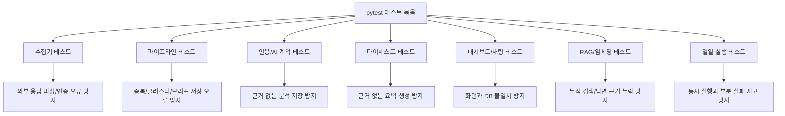

# 08. 테스트와 품질 게이트

## 한 줄 요약

테스트는 수집 실패 격리, 근거 없는 AI 결과 차단, 중복 실행 방지, 화면 조회 정확성, 누적 RAG 검색 품질을 검증한다.

## 비개발자 설명

이 프로젝트의 테스트는 단순히 코드가 실행되는지만 보는 것이 아니다. 운영 중 발생할 수 있는 사고를 막는 역할을 한다.

대표적으로 다음 사고를 막는다.

- 외부 API 하나가 실패해서 하루 전체 실행이 멈추는 사고
- AI가 인용 근거 없이 분석이나 답변을 저장하는 사고
- 같은 일일 실행이 동시에 두 번 돌아 중복 데이터가 생기는 사고
- 대시보드가 DB의 근거와 다른 내용을 보여주는 사고
- 누적 채팅이 관련 없는 과거 문서를 근거로 답하는 사고

## 설계도

### 다이어그램 코드 매핑

| 설계도 박스 | 담당 테스트 |
| --- | --- |
| `수집기 테스트` | `tests/test_rss.py`, `tests/test_naver.py`, `tests/test_opendart_docs.py`, `tests/test_edgar_docs.py`, `tests/test_marketaux.py`, `tests/test_finnhub.py` |
| `파이프라인 테스트` | `tests/test_pipeline.py`, `tests/test_dedup.py`, `tests/test_ticker_link.py`, `tests/test_openfigi.py` |
| `인용/AI 계약 테스트` | `tests/test_citations.py`, `tests/test_swap.py` |
| `다이제스트 테스트` | `tests/test_digest.py`, `tests/test_digest_view.py` |
| `대시보드/채팅 테스트` | `tests/test_web.py`, `tests/test_health.py` |
| `RAG/임베딩 테스트` | `tests/test_embed.py`, `tests/test_rag_chat.py`, `tests/test_integration_stage15.py` |
| `일일 실행 테스트` | `tests/test_runner.py` |

## 코드/폴더 매핑

| 테스트 파일 | 검증하는 기능 | 막는 사고 |
| --- | --- | --- |
| [`tests/test_runner.py`](../../tests/test_runner.py) | `run_daily`, `_collect`, advisory lock, audit log | 소스 하나 실패가 전체 실행을 중단하거나 중복 실행되는 사고 |
| [`tests/test_pipeline.py`](../../tests/test_pipeline.py) | `run_pipeline`, `generate_impact`, `analyze_impact` | 클러스터/브리프/인용 저장 순서 오류 |
| [`tests/test_digest.py`](../../tests/test_digest.py) | `build_digest`, 2-pass digester | 근거 없는 다이제스트 생성, 재실행 중복 |
| [`tests/test_rag_chat.py`](../../tests/test_rag_chat.py) | `search_citation_spans`, 누적 채팅 | 과거 근거 검색 실패 또는 인용 없는 답변 |
| [`tests/test_web.py`](../../tests/test_web.py) | 대시보드 조회, 날짜 칩, 채팅 HTML | 화면이 DB 결과를 잘못 묶거나 잘못 표시 |
| [`tests/test_citations.py`](../../tests/test_citations.py) | Citation document index 매핑, Pass 2 입력 제한 | 원문과 인용 매핑이 뒤바뀌거나 근거 범위를 벗어나는 사고 |
| [`tests/test_dedup.py`](../../tests/test_dedup.py) | SimHash 중복 탐지 | 같은 기사 중복 노출 또는 무관 기사 묶임 |
| [`tests/test_ticker_link.py`](../../tests/test_ticker_link.py) | 별칭 기반 종목 연결 | 잘못된 ticker 연결 또는 후보 표시 누락 |
| [`tests/test_embed.py`](../../tests/test_embed.py) | 임베딩 생성/저장 | RAG 검색 코퍼스가 비거나 중복 갱신되는 사고 |

## 수집기 테스트 묶음

| 테스트 파일 | 주요 검증 |
| --- | --- |
| [`tests/test_rss.py`](../../tests/test_rss.py) | XML 파싱, HTML 제거, 날짜 파싱, feed 언어 |
| [`tests/test_naver.py`](../../tests/test_naver.py) | Naver API 응답 파싱, 인증 헤더, HTML 제거 |
| [`tests/test_opendart_docs.py`](../../tests/test_opendart_docs.py) | 공시 목록 파싱, ZIP 본문 추출, API 키 누락 |
| [`tests/test_edgar_docs.py`](../../tests/test_edgar_docs.py) | SEC 제출 문서 필터링, HTML 본문 추출, User-Agent |
| [`tests/test_marketaux.py`](../../tests/test_marketaux.py) | 뉴스 목록 파싱, API 토큰, 날짜 처리 |
| [`tests/test_finnhub.py`](../../tests/test_finnhub.py) | 뉴스 목록 파싱, API 토큰, Unix timestamp 처리 |

## 품질 게이트 관점

| 게이트 | 기준 |
| --- | --- |
| 수집 게이트 | 각 수집기는 `fetch -> normalize -> upsert` 계약을 지켜야 한다 |
| 근거 게이트 | 인용 근거가 없으면 `status="ok"` 분석이나 답변으로 통과하지 못한다 |
| 중복 게이트 | 재실행해도 같은 날짜 데이터가 불필요하게 늘어나면 안 된다 |
| 동시 실행 게이트 | 이미 실행 중인 작업은 advisory lock으로 거절되어야 한다 |
| 화면 게이트 | 화면은 DB에 저장된 브리프, 인용, 다이제스트를 일관되게 보여야 한다 |
| RAG 게이트 | 누적 채팅은 임베딩 검색 결과와 citation 안에서만 답해야 한다 |

## 왜 이렇게 만들었나

이 시스템은 외부 API, DB, AI 모델, 화면이 함께 얽혀 있다. 한 부분만 단위 테스트하면 실제 운영 사고를 놓치기 쉽다. 그래서 테스트는 수집기처럼 작은 단위부터 `run_daily`처럼 여러 단계를 묶는 통합 흐름까지 나누어져 있다.

특히 AI 관련 테스트는 응답 내용의 "좋고 나쁨"보다 계약을 본다. 인용이 있는지, 인용 index가 올바른 문서로 연결되는지, 구조화 단계가 인용 범위를 벗어나지 않는지가 핵심이다.

## 관련 테스트

이 문서 자체가 테스트 영역 설명이므로, 전체 테스트 폴더인 [`tests/`](../../tests)를 기준으로 읽으면 된다. 빠르게 훑을 때는 `tests/test_runner.py`, `tests/test_pipeline.py`, `tests/test_citations.py`, `tests/test_digest.py`, `tests/test_rag_chat.py`, `tests/test_web.py` 순서가 좋다.

## 다음에 읽을 문서

1. [00. 시스템 전체 개요](./00-system-overview.md)
2. [03. 영향 분석 파이프라인](./03-impact-pipeline.md)
