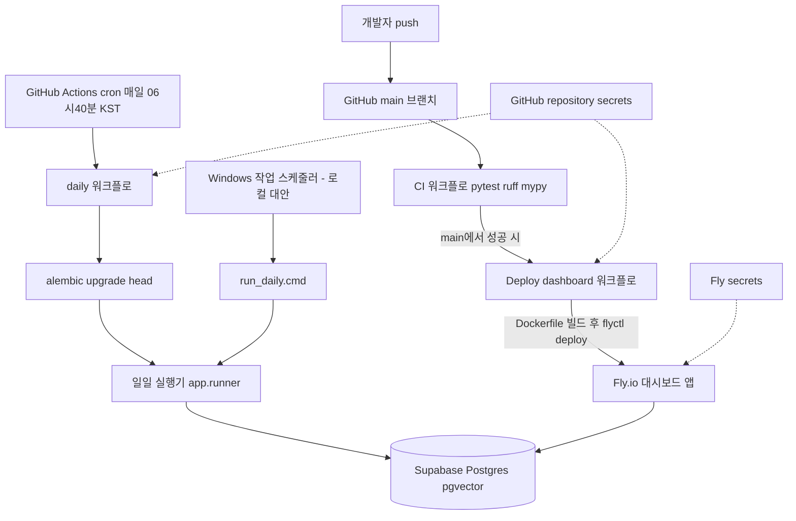

# 09. 배포와 운영

## 한 줄 요약

데이터 수집은 GitHub Actions cron(`daily.yml`)이 Supabase Postgres에 매일 적재하고, 대시보드는 CI 통과 후 `deploy-dashboard.yml`이 Dockerfile 이미지를 Fly.io 앱 `finance-agent-dashboard`로 자동 배포한다.

## 비개발자 설명

이 시스템은 "매일 데이터를 모으는 작업"과 "모은 결과를 보여주는 화면" 두 부분이 서로 다른 곳에서 돌아간다.

데이터 수집은 GitHub이 제공하는 예약 실행 기능(GitHub Actions)이 매일 아침 06:40 KST에 자동으로 수행한다. 실행할 때마다 새 컴퓨터를 빌려 쓰고 끝나면 반납하기 때문에, 결과는 그 컴퓨터가 아니라 외부의 상시 데이터베이스(Supabase)에 저장한다. 그래야 어제 수집한 것과 오늘 수집한 것을 이어서 비교할 수 있다.

화면(대시보드)은 Fly.io라는 호스팅 서비스에 올라가 있어 어디서든 웹 브라우저로 접속할 수 있다. 아무나 볼 수 없도록 아이디/비밀번호(Basic Auth)를 요구하며, 코드가 수정되어 저장소에 반영되면 테스트가 먼저 통과된 경우에만 새 버전이 자동으로 배포된다.

비밀번호나 API 키 같은 민감한 값은 코드에 적지 않는다. 로컬에서는 `.env` 파일, GitHub에서는 repository secrets, Fly.io에서는 Fly secrets에 각각 보관하고 실행 시점에만 주입된다.

## 설계도

### 다이어그램 코드 매핑

| 설계도 박스 | 담당 코드 |
| --- | --- |
| `CI 워크플로` | [`.github/workflows/ci.yml`](../../.github/workflows/ci.yml) |
| `Deploy dashboard 워크플로` | [`.github/workflows/deploy-dashboard.yml`](../../.github/workflows/deploy-dashboard.yml) |
| `Fly.io 대시보드 앱` | [`Dockerfile`](../../Dockerfile), [`fly.toml`](../../fly.toml), `app/main.py::health`, `app/main.py::_require_dashboard_auth` |
| `daily 워크플로` | [`.github/workflows/daily.yml`](../../.github/workflows/daily.yml) |
| `일일 실행기 app.runner` | `app/runner.py::main` |
| `Windows 작업 스케줄러 - 로컬 대안` | [`scripts/schedule_daily.cmd`](../../scripts/schedule_daily.cmd) |
| `run_daily.cmd` | [`scripts/run_daily.cmd`](../../scripts/run_daily.cmd) |
| `GitHub repository secrets` / `Fly secrets` | [`app/config.py`](../../app/config.py) `Settings`가 환경변수로 수신 |

## 코드/폴더 매핑

| 파일 | 역할 |
| --- | --- |
| [`Dockerfile`](../../Dockerfile) | 대시보드용 uv 기반 이미지. 의존성 레이어를 먼저 캐시하고 uvicorn을 8080 포트로 기동. embeddings extra는 설치하지 않음 |
| [`fly.toml`](../../fly.toml) | Fly 앱 `finance-agent-dashboard` 설정. nrt(도쿄) 리전, 유휴 시 자동 정지, 4GB 메모리 |
| [`.github/workflows/ci.yml`](../../.github/workflows/ci.yml) | push/PR마다 실 Postgres+pgvector 서비스에서 pytest, ruff, mypy 실행 |
| [`.github/workflows/daily.yml`](../../.github/workflows/daily.yml) | 매일 21:40 UTC(=06:40 KST) cron. alembic upgrade head 후 `python -m app.runner` |
| [`.github/workflows/deploy-dashboard.yml`](../../.github/workflows/deploy-dashboard.yml) | main에서 CI 성공 시 `flyctl deploy --local-only`로 대시보드 배포 |
| [`scripts/run_daily.cmd`](../../scripts/run_daily.cmd) | 로컬 일일 실행 본체. `logs\daily.log`에 출력 append |
| [`scripts/schedule_daily.cmd`](../../scripts/schedule_daily.cmd) | Windows 작업 스케줄러에 `finance_agent_daily`(매일 06:40 로컬 TZ) 등록 |
| [`scripts/crontab.example`](../../scripts/crontab.example) | Linux/VM용 cron 예시. 서버 TZ(KST/UTC)에 따른 두 줄 제공 |
| [`scripts/validate_keys.py`](../../scripts/validate_keys.py) | 커넥터별 라이브 fetch 1회로 API 키 상태(ok/미설정/무효키/쿼터/네트워크) 판정 |
| [`scripts/build_digest_for.py`](../../scripts/build_digest_for.py) | 특정일 다이제스트만 재생성(신규 수집 없음) — 크래시 복구용 |
| [`app/config.py`](../../app/config.py) | 모든 환경변수의 단일 수신 경계(`Settings`, `.env` 로드) |

## 배포 경로

대시보드 배포는 세 단계다.

1. main에 push되면 `ci.yml`이 pytest+ruff+mypy를 실행한다.
2. CI가 main에서 성공하면 `deploy-dashboard.yml`이 `workflow_run`으로 이어 받아, CI가 검증한 바로 그 커밋(`head_sha`)을 체크아웃한다. 수동 배포가 필요하면 `workflow_dispatch`로도 실행할 수 있다.
3. flyctl(0.4.64 고정)이 GitHub runner의 Docker로 이미지를 빌드해(`--local-only`) Fly 앱 `finance-agent-dashboard`에 배포한다.

`Dockerfile`은 `pyproject.toml`/`uv.lock`만 먼저 복사해 의존성 레이어를 캐시하고, embeddings extra(torch ~2GB)를 설치하지 않는다 — 임베더가 없으면 누적 RAG 경로가 graceful degrade 하므로 웹 이미지에 모델을 실을 이유가 없다. `fly.toml`은 유휴 시 머신을 정지시켜(`auto_stop_machines`) 비용을 줄이고, 요청이 오면 자동 기동한다. 배포 후 스모크 체크는 공개 `/health`(200)와 미인증 `/`(401)로 한다. 상태 문서만 고치는 커밋은 `[skip ci]`를 붙여 CI→배포 루프를 피한다.

## 일일 실행 운영

프로덕션 일일 실행은 `daily.yml`이 담당한다.

- cron은 UTC 기준 `40 21 * * *`로, 전날 21:40 UTC = 당일 06:40 KST다. schedule은 best-effort라 지연될 수 있고(실측 07:07 KST 시작), main 브랜치에서만 활성이며, 저장소가 60일간 무활동이면 자동 비활성된다. 수동 실행은 `workflow_dispatch`.
- `concurrency: group: daily`로 이전 실행이 안 끝났으면 겹치지 않게 막는다. 앱 내부 advisory lock과 별개의 1차 방어다.
- 실행 순서는 `alembic upgrade head` → `python -m app.runner`. 모든 소스를 켠 뒤 실행 시간이 30분을 넘겨 timeout은 90분이다.
- Actions에는 embeddings extra를 설치하지 않으므로 `get_embedder()`가 None을 반환하고 RAG 코퍼스 적재만 건너뛴다.

로컬 대안도 체크인돼 있다. Windows는 `scripts/schedule_daily.cmd`가 schtasks에 매일 06:40(로컬 TZ) 작업을 등록하고, 작업 본체 `scripts/run_daily.cmd`는 스크립트 위치에서 프로젝트 루트를 도출해 `logs\daily.log`에 append한다. Linux/VM은 `scripts/crontab.example`을 쓰되 서버 TZ에 맞는 줄(KST 06:40 또는 UTC 21:40)을 골라야 한다.

운영 시 주의: `app.runner` 재실행은 멱등 no-op이 아니다 — 신선도 윈도우 안의 새 뉴스를 또 수집한다. 다이제스트 단계만 실패한 크래시 복구는 재실행 대신 `scripts/build_digest_for.py`로 해당 날짜 다이제스트만 재생성한다. 외부 API 키가 죽었는지 의심되면 `scripts/validate_keys.py`가 적재 없이 키 상태만 판정해 준다.

## 시크릿과 환경변수

모든 설정은 [`app/config.py`](../../app/config.py)의 `Settings` 하나로 들어온다. 로컬은 `.env` 파일, GitHub Actions는 repository secrets를 workflow `env:`로, Fly는 `flyctl secrets set`으로 주입한다. 키가 없는 소스는 커넥터가 비활성되어 격리 skip되므로, 시크릿 일부가 비어도 전체 실행은 계속된다.

| 위치 | 값 |
| --- | --- |
| GitHub secrets (`daily.yml`) | `DATABASE_URL`(필수), `ANTHROPIC_API_KEY`, `OPENDART_API_KEY`, `SEC_EDGAR_USER_AGENT`, `OPENFIGI_API_KEY`, `COINGECKO_API_KEY`, `MARKETAUX_API_KEY`, `FINNHUB_API_KEY`, `NAVER_CLIENT_ID`/`NAVER_CLIENT_SECRET` |
| GitHub secrets (`deploy-dashboard.yml`) | `FLY_API_TOKEN` — flyctl 호환을 위해 `FLY_API_TOKEN`/`FLY_ACCESS_TOKEN` 둘 다로 전달 |
| Fly secrets | `DATABASE_URL`, `ANTHROPIC_API_KEY`, `DASHBOARD_USERNAME`, `DASHBOARD_PASSWORD` |

대시보드 Basic Auth는 fail-closed다: `DASHBOARD_USERNAME`/`DASHBOARD_PASSWORD`가 미설정이면 보호 라우트(`/`, `/chat`, `/trigger`, `/run-daily`)는 401을 반환하고 `/health`만 공개다. 시크릿을 깜빡해도 대시보드가 조용히 공개되는 일은 없다.

## 왜 이렇게 만들었나

- **일일 실행이 GitHub Actions + 매니지드 DB인 이유**: Actions의 service 컨테이너는 job이 끝나면 삭제돼 일일 누적(dedup, 랭킹)에 쓸 수 없다. 그래서 수집 결과는 Supabase Postgres+pgvector에 `DATABASE_URL` 시크릿으로 적재한다. 스케줄러와 대시보드 런타임을 분리한 것도 같은 맥락이다 — Fly는 화면만, Actions는 수집만 담당한다.
- **cron이 21:40 UTC인 이유**: `brief_date`와 신선도 컷오프는 KST 기준이다. 날짜 경계를 UTC로 잡으면 KST 오전 실행분이 통째로 잘려 브리프가 0이 되는 회귀를 실측했다(132건 수집에도 후보 0건). 그래서 cron 시각도, `crontab.example`의 TZ 주석도 06:40 KST를 기준으로 환산한다.
- **concurrency와 advisory lock의 이중 방어**: `pg_try_advisory_lock`은 연결 단위 락이라 커밋 후 다른 풀 연결에서 언락되면 락이 새는 사고가 있었다(전용 연결로 수정). 워크플로 수준 `concurrency` 그룹은 이 앱 내부 락과 독립적인 1차 방어로 둔다.
- **CI가 실 Postgres+pgvector에서 도는 이유**: pytest/ruff/mypy만으로는 날짜 결합 회귀, 인코딩, nullable 드리프트 같은 결함이 통과된다. CI는 `ankane/pgvector` 서비스 컨테이너로 통합 테스트까지 강제한다. 단 마이그레이션 자체의 upgrade→check→downgrade 라운드트립은 CI 밖의 실DB 검증 컨벤션으로 다룬다.
- **배포가 `--local-only`이고 flyctl이 0.4.64로 고정된 이유**: app-scoped deploy 토큰으로 Fly remote builder가 unauthorized를 반환했고, 0.4.66은 같은 토큰에 token validation error를 냈다. 로컬에서 검증된 조합을 그대로 고정한 것이다.
- **alembic이 URL을 configparser로 왕복시키지 않는 이유**: Supabase처럼 특수문자 비밀번호를 URL-인코딩하면 `%40` 등의 `%`를 configparser 보간이 오인해 env.py import부터 죽는다. `migrations/env.py`는 `settings.database_url`을 `create_engine`에 직접 넘긴다.
- **로컬 로그가 파일 append인 이유**: Windows에서 비-ASCII `print`는 cp949 stdout에서 죽는 사고가 있어 `app/runner.py::main`이 진입부에서 stdout을 UTF-8로 재구성하고, 스케줄러 실행분은 `logs\daily.log`로 남겨 사후 추적한다.

## 관련 테스트

| 테스트 파일 | 막는 사고 |
| --- | --- |
| [`tests/test_health.py`](../../tests/test_health.py) | `/health` 공개 유지, 보호 라우트의 401(잘못된 인증·인증 미설정 fail-closed 포함), `/trigger` 중복 실행 409 검증 |
| [`tests/test_runner.py`](../../tests/test_runner.py) | 일일 실행이 수집기 실패를 격리하고 중복 실행을 막는지 검증 — `daily.yml`이 매일 부르는 진입점의 안전장치 |

이와 별개로 `ci.yml`은 [`tests/`](../../tests) 전체를 실 Postgres+pgvector에서 실행해 머지/배포 게이트 역할을 한다.

## 다음에 읽을 문서

- [학습 문서 인덱스](README.md)
